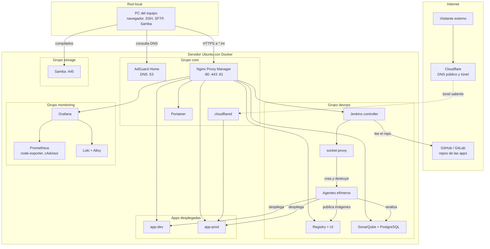
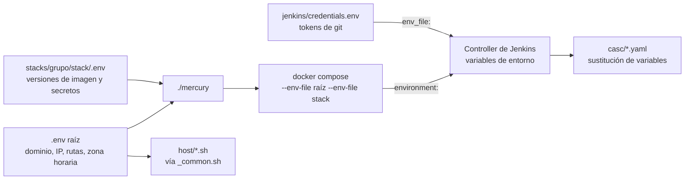

# 6. Arquitectura

Qué piezas hay, cómo se organizan y qué reglas las mantienen unidas. El detalle de cada área está en los documentos 07 a 11.

## Vista general



Hay dos puertas de entrada y no se cruzan:

- **Desde la LAN**, todo pasa por Nginx Proxy Manager con HTTPS, bajo nombres `*.int.<dominio>` que solo AdGuard conoce.
- **Desde internet**, lo único alcanzable son las apps de producción, a través del túnel de Cloudflare, que apunta directo al contenedor de la app sin pasar por NPM.

## Estructura del repo

```
mercury                       Operador de los stacks (bash). Fuente de verdad de qué existe
.env.example                  Variables comunes: dominio, IP, rutas
.dockerignore                 Filtra el contexto de build de la imagen base de agentes
host/                         Preparación de Ubuntu, en scripts numerados
  _common.sh                  Carga .env y define constantes; lo incluyen todos los demás
  01-base.sh … 06-dns.sh      Paquetes, discos, Docker, redes, backup, DNS
  backup.sh                   Backup diario (lo llama un timer de systemd)
  migrate-layout.sh           Migración única a la estructura por grupos
  files/                      daemon.json base y parámetros de kernel
stacks/<grupo>/<stack>/       Un proyecto compose por carpeta
  compose.yaml
  .env.example                Versiones de imagen y secretos de ejemplo
apps/_templates/              Empaquetado y despliegue de apps
  compose.deploy.yaml         Único compose de despliegue, para todo runtime y canal
  <runtime>/Dockerfile        Empaqueta un compilado ya hecho
  <runtime>/Jenkinsfile*      Plantilla de pipeline que se copia al repo de la app
  <runtime>/compose.quick.yaml  Modo rápido
pipelines/
  lib/mercury-ci              Pasos compartidos por todos los pipelines (bash)
  manual-release/Jenkinsfile  Job del canal manual
docs/                         Esta documentación
  instalacion/                Guías para levantar y operar el servidor
  arquitectura/               Cómo está construido y cómo mantenerlo
  scripts/                    Interior de mercury y mercury-ci
```

Piezas que actúan como fuente de verdad y de las que dependen otras:

| Pieza | Qué decide | Quién depende de ella |
|---|---|---|
| Lista `STACKS` de `mercury` | Qué stacks existen y en qué orden arrancan con `all` | Todos los comandos de `mercury` |
| Lista `AGENTS` y mapa `AGENT_DEFAULT` de `mercury` | Catálogo de agentes y versión por defecto | `./mercury agents`, plantillas de `casc/jenkins.yaml` |
| Lista `RUNTIMES` de `mercury` | Runtimes con modo rápido | `./mercury quick` |
| `pipelines/lib/mercury-ci` | Cómo se escanea, empaqueta y despliega | Todos los Jenkinsfile, ambos canales |
| `apps/_templates/compose.deploy.yaml` | Cómo es un contenedor de app desplegado | `mercury-ci deploy` y `./mercury deploy` |
| `casc/jenkins.yaml` | Agentes, carpetas y job `manual-release` de Jenkins | Jenkins al arrancar |
| `host/_common.sh` | Rango de redes de Docker, UID del canal manual, generación de `daemon.json` | Todos los scripts de `host/` |

## Stacks

| Grupo | Stack | Contenedores | Redes | Puertos publicados | Datos |
|---|---|---|---|---|---|
| `core` | `dns` | `adguard` | `net-tools` | `LAN_IP:53` tcp y udp | `DATA_DIR/adguard` |
| `core` | `edge` | `npm`, `cloudflared` (perfil `tunnel`), `whoami-prod` (perfil `test`) | `net-tools`, `net-apps-dev`, `net-apps-prod` | `80`, `443`, `LAN_IP:81` | `DATA_DIR/npm` |
| `core` | `management` | `portainer` | `net-tools` | ninguno | `DATA_DIR/portainer` |
| `devops` | `registry` | `registry`, `registry-ui` | `net-tools` | ninguno | `HDD_DIR/registry`, `DATA_DIR/registry/auth` |
| `devops` | `jenkins` | `jenkins`, `socket-proxy`, agentes | `net-tools`, `mercury-jenkins` | ninguno | `DATA_DIR/jenkins` |
| `devops` | `sonarqube` | `sonarqube`, `sonar-db` | `net-tools`, `db` (interna) | ninguno | `DATA_DIR/sonarqube` |
| `monitoring` | `metrics` | `prometheus`, `node-exporter`, `cadvisor` | `net-tools`, `net-obs`, red del host | ninguno (node-exporter escucha en el host) | `HDD_DIR/prometheus` |
| `monitoring` | `logs` | `loki`, `alloy` | `net-obs` | ninguno | `HDD_DIR/loki`, `DATA_DIR/alloy` |
| `monitoring` | `grafana` | `grafana` | `net-tools`, `net-obs` | ninguno | `DATA_DIR/grafana` |
| `storage` | `files` | `samba` | red por defecto del proyecto | `LAN_IP:445` | `INBOX_DIR` |

El orden de arranque de `./mercury up all` es el de la lista `STACKS`: primero DNS y proxy, luego registry (Jenkins descarga de él las imágenes de agente), después el resto.

## Configuración en dos niveles



- `mercury` invoca siempre `docker compose --env-file .env --env-file stacks/<grupo>/<stack>/.env -f .../compose.yaml`. Las variables del segundo archivo prevalecen si se repiten.
- Los scripts de `host/` leen solo el `.env` raíz, a través de `host/_common.sh`.
- **Excepción de Jenkins.** Los tokens de las cuentas de git van en `stacks/devops/jenkins/credentials.env`. El compose lo pasa entero al controller con `env_file`, de modo que añadir una cuenta no obliga a tocar el compose. `casc/credentials.yaml` convierte esas variables en credenciales de Jenkins.
- Solo se versionan los `.env.example`. `.gitignore` excluye `.env` y `credentials.env`. **Un valor real nunca va en un `.env.example`.**
- `mercury` se niega a operar un stack sin su `.env`. Con un grupo o `all`, los stacks sin `.env` se omiten con un aviso en lugar de abortar.

La referencia completa de variables está en [12-referencia.md](12-referencia.md#variables).

## Datos fuera del repo

| Variable | Ruta por defecto | Disco | Contenido |
|---|---|---|---|
| `DATA_DIR` | `/srv/mercury/data` | SSD | Estado de los servicios: Jenkins, SonarQube y su base de datos, NPM y certificados, AdGuard, Grafana, Portainer, usuarios del registry |
| `APPS_DIR` | `/srv/mercury/apps` | SSD | Un archivo `<env>/<app>.env` por app y ambiente, con su configuración y secretos |
| `INBOX_DIR` | `/srv/mercury/sftp/inbox` | SSD | Compilados del canal manual |
| `HDD_DIR` | `/mnt/hdd/mercury` | HDD | Lo voluminoso y regenerable: capas del registry, métricas, logs. También los backups |

`host/02-disks.sh` crea cada directorio con el dueño que espera su imagen. **Solo crea lo que falta y nunca cambia el dueño de un directorio existente**: algunas imágenes (PostgreSQL) reasignan el dueño al arrancar y repetir el script lo rompería.

| UID:GID | Quién | Directorios |
|---|---|---|
| `0:0` | root | NPM, registry, Portainer, AdGuard, Alloy, base de datos de SonarQube, backups |
| `1000:1000` | `jenkins` (controller y agentes), `sonarqube` | `DATA_DIR/jenkins`, `DATA_DIR/sonarqube/{data,extensions,logs}`, `APPS_DIR` |
| `472:472` | `grafana` | `DATA_DIR/grafana` |
| `65534:65534` | `nobody` (Prometheus) | `HDD_DIR/prometheus` |
| `10001:10001` | `loki` | `HDD_DIR/loki` |
| `2000:2000` | `deployer` / `mercury-deploy` | `INBOX_DIR` (modo `2775`, con setgid) |

Dos dueños explican comportamientos que de otro modo sorprenden:

- `APPS_DIR` es del UID 1000 porque quien lee `<app>.env` al desplegar es el usuario `jenkins` del agente.
- `INBOX_DIR` es del UID 2000 con setgid porque escriben en él tanto el usuario SFTP `deployer` como el contenedor de Samba (que se configura con `UID=2000`, `GID=2000`), y los agentes deben poder leer lo subido.

Un servicio nuevo con bind-mount necesita su línea `mk` en `host/02-disks.sh`. Si se levanta antes de ejecutar el script, Docker crea el directorio como root y hay que corregir el dueño a mano.

## Presupuesto de memoria

Todo servicio lleva `mem_limit`. La suma de límites es el peor caso, no el consumo habitual.

| Stack | Límites | Total |
|---|---|---|
| `dns` | adguard 256 MB | 0,26 GB |
| `edge` | npm 384 MB, cloudflared 128 MB (whoami 32 MB) | 0,51 GB |
| `management` | portainer 256 MB | 0,26 GB |
| `registry` | registry 256 MB, registry-ui 64 MB | 0,32 GB |
| `jenkins` | controller 1536 MB, socket-proxy 64 MB | 1,60 GB |
| `sonarqube` | sonarqube 3 GB, sonar-db 512 MB | 3,50 GB |
| `metrics` | prometheus 512 MB, node-exporter 64 MB, cadvisor 192 MB | 0,77 GB |
| `logs` | loki 512 MB, alloy 256 MB | 0,77 GB |
| `grafana` | grafana 384 MB | 0,38 GB |
| `files` | samba 128 MB | 0,13 GB |
| | **Servicios permanentes** | **≈ 8,5 GB** |

Lo que se suma durante un build:

| Elemento | Límite | Dónde se define |
|---|---|---|
| Agente `dotnet`, `maven`, `node` | 2048 MB, sin swap adicional | `memoryLimit` y `memorySwap` en `casc/jenkins.yaml` |
| Agente `python` | 1536 MB | ídem |
| Agente `base` | 1024 MB | ídem |
| Cada escáner (Trivy, Semgrep, sonar-scanner) | 1536 MB | `MERCURY_SCAN_MEMORY` en `mercury-ci` |
| Cada app desplegada | 512 MB por defecto | `APP_MEM_LIMIT` en `compose.deploy.yaml` |

Los escáneres llevan límite propio porque son contenedores hermanos: corren fuera del límite del agente. Con 12 GB y SonarQube en marcha, `JENKINS_MAX_AGENTS=2` es el máximo prudente. El host tiene además swap hasta 8 GB con `vm.swappiness=10`, como colchón para picos.

Para liberar memoria sin perder datos: `./mercury down sonarqube` (3,5 GB) y `./mercury down monitoring` (1,9 GB).

Al añadir un servicio, su `mem_limit` se suma a esta tabla y a la de `README.md`.

## Modelo de seguridad

| Capa | Mecanismo | Dónde |
|---|---|---|
| Acceso al host | SSH solo con llave y sin root; `deployer` solo SFTP dentro de un chroot | `host/01-base.sh` |
| Puertos del host | UFW deniega lo entrante salvo 22, 80, 443 y, desde la LAN, 53, 81 y 445 | `host/01-base.sh` |
| Puertos de contenedores | Solo NPM, AdGuard y Samba usan `ports:`, ligados a `LAN_IP` salvo 80 y 443 | Composes de `core` y `storage` |
| Entre contenedores | Redes separadas por función; bases de datos en red `internal` | [07-redes-y-dns.md](07-redes-y-dns.md) |
| Internet hacia dentro | Solo el túnel, y solo hacia `net-apps-prod` | `stacks/core/edge` |
| Docker desde Jenkins | A través de `socket-proxy`, en una red no compartida | `stacks/devops/jenkins` |
| Contenedores | `no-new-privileges` salvo donde rompe o no está probado (Samba, cAdvisor, AdGuard) | Composes |
| Secretos | Fuera de git (`.env`, `credentials.env`, `APPS_DIR`) | `.gitignore` |

Límites que conviene tener presentes, porque no son evidentes:

- **Docker salta UFW.** Un puerto publicado con `ports:` queda abierto aunque UFW lo deniegue, porque Docker escribe sus propias reglas. La protección real es no publicar puertos.
- **Un pipeline equivale a root en el servidor.** `socket-proxy` filtra operaciones, pero permite crear contenedores, y quien puede crear contenedores puede montar cualquier ruta del host. Por eso la red `mercury-jenkins` no se comparte con ningún otro servicio.
- **Portainer y Alloy montan el socket de Docker directamente.** Portainer es opcional y debe quedarse en la LAN con una contraseña fuerte.
- **Todos los usuarios de Jenkins son administradores** (`loggedInUsersCanDoAnything`) y cualquier Jenkinsfile puede pedir cualquier credencial por su ID. Compartir Jenkins es confiar el servidor entero. Ver [04-operacion-y-futuro.md](../instalacion/04-operacion-y-futuro.md#jenkins-compartido).
- **Dev y prod comparten máquina.** Los separa la red, y el límite de memoria por contenedor evita que una prueba en dev deje sin RAM a producción.

## Convenciones transversales

Varias piezas dan estas reglas por supuestas. Romper una exige cambiar todas las que dependen de ella.

| Convención | Depende de ella |
|---|---|
| Toda app escucha en el puerto **8080** | Dockerfiles de runtime, Proxy Hosts de NPM, hostnames del túnel |
| El contenedor de una app se llama **`<app>-<dev\|prod>`** | `compose.deploy.yaml`, `compose.quick.yaml`, NPM, túnel, `./mercury undeploy` |
| Nombre de app: `^[a-z0-9]([a-z0-9-]{0,40}[a-z0-9])?$` | Validado igual en `mercury` y en `mercury-ci` |
| Imágenes de app: `<REGISTRY_HOST>/apps/<app>:<tag>` | `mercury-ci`, `./mercury deploy` |
| Imágenes de agente: `<REGISTRY_HOST>/agents/<agente>:<versión>` | `./mercury agents`, `casc/jenkins.yaml` |
| Ninguna imagen usa `latest` | Reproducibilidad y vuelta atrás |
| Dominios internos de un solo nivel: `<app>-dev.int.<dominio>` | El certificado wildcard no cubre más niveles |
| Todas las redes de Docker salen de `10.200.0.0/16` | Regla UFW para Prometheus (`DOCKER_POOL` en `host/_common.sh`) |
| Los ID de credencial `registry` y `sonar-token` no cambian | Plantillas de agente, `mercury-ci`, todos los Jenkinsfile |

Convenciones de todo `compose.yaml`: `name:` explícito; versión de imagen en una variable del `.env` del stack; `restart: unless-stopped`; `mem_limit`; `no-new-privileges` cuando es posible; sin `ports:` salvo que el protocolo no sea HTTP.
