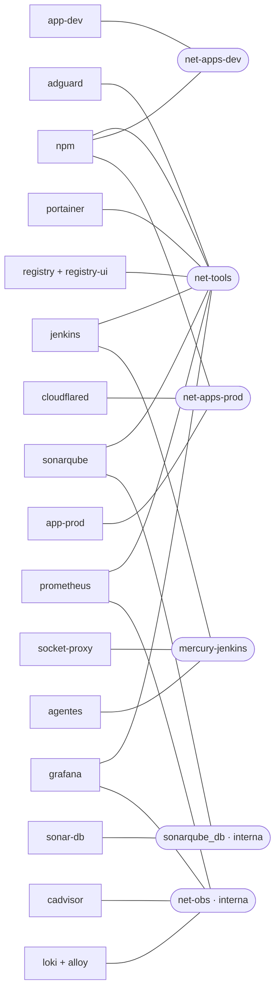
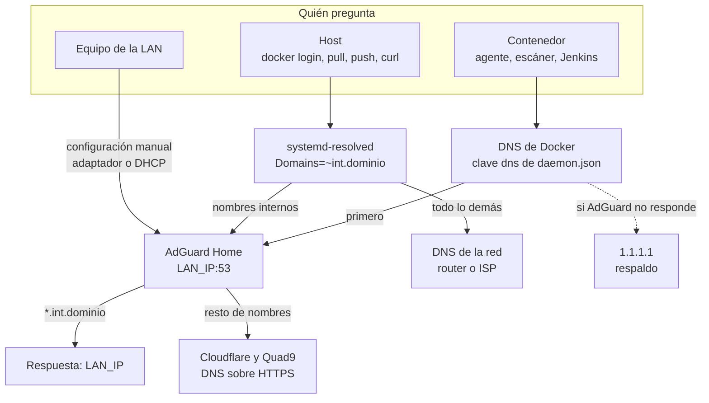
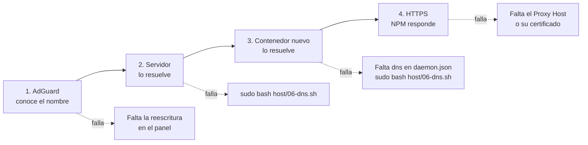
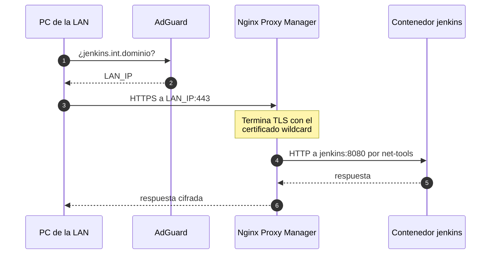
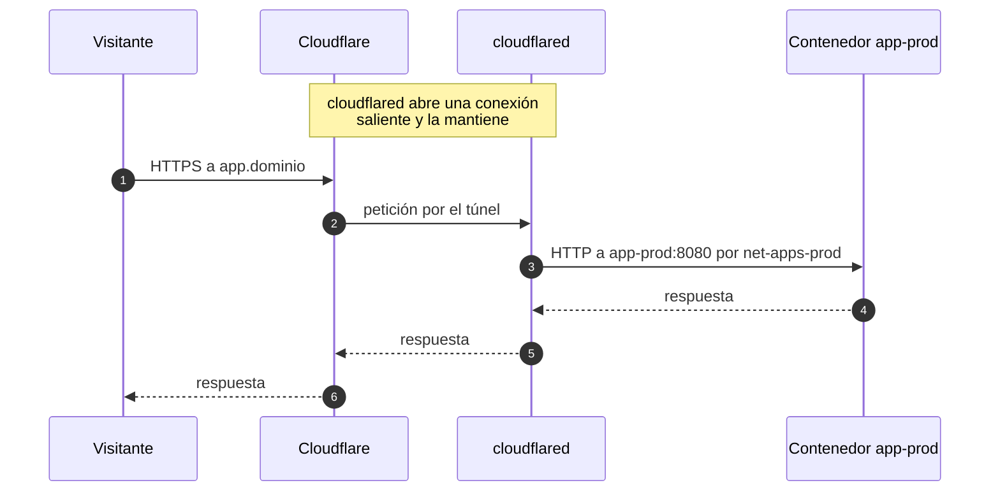

# 7. Redes y DNS

Quién puede hablar con quién, cómo se resuelve un nombre y por dónde entra cada tipo de tráfico.

## Principio: aislar por red

Un contenedor solo alcanza a los contenedores con los que comparte red, y los alcanza por nombre (`http://jenkins:8080`). No hay reglas de firewall entre contenedores: el aislamiento consiste en decidir a qué redes se conecta cada uno.

## Redes

| Red | Tipo | La crea | Quién está | Para qué |
|---|---|---|---|---|
| `net-tools` | externa | `host/04-networks.sh` | `npm`, `adguard`, `portainer`, `registry`, `registry-ui`, `jenkins`, `sonarqube`, `prometheus`, `grafana` | Herramientas internas; NPM las enruta por nombre |
| `net-apps-dev` | externa | `host/04-networks.sh` | `npm`, apps `<app>-dev` | Apps en dev |
| `net-apps-prod` | externa | `host/04-networks.sh` | `npm`, `cloudflared`, `whoami-prod`, apps `<app>-prod` | Apps en prod; única red que ve el túnel |
| `net-obs` | externa e interna | `host/04-networks.sh` | `prometheus`, `cadvisor`, `loki`, `alloy`, `grafana` | Observabilidad, sin salida a otras redes |
| `mercury-jenkins` | del stack `jenkins`, con nombre fijo | compose de Jenkins | `jenkins`, `socket-proxy`, agentes, Trivy al escanear una imagen | Acceso a la API de Docker. No se comparte |
| `sonarqube_db` | del stack `sonarqube`, interna | compose de SonarQube | `sonarqube`, `sonar-db` | Solo SonarQube habla con su base de datos |
| red del host | `network_mode: host` | — | `node-exporter` | Ver interfaces y discos reales |
| `bridge` por defecto | de Docker | — | Escáneres lanzados por `mercury-ci` (Semgrep, sonar-scanner, Trivy de archivos) | Solo necesitan salida a internet y a NPM |

Lo que se deduce del diagrama:

- **`cloudflared` solo está en `net-apps-prod`.** Aunque alguien añada por error un hostname público hacia `jenkins:8080`, ese nombre no resuelve desde el túnel.
- **Los agentes solo están en `mercury-jenkins`.** No comparten red con el registry ni con SonarQube: los alcanzan por su nombre interno (`https://registry.int.<dominio>`), pasando por NPM. Por eso los contenedores necesitan resolver `*.int.<dominio>`.
- **Una app en dev no puede hablar con una en prod**, ni con ninguna herramienta.
- **Prometheus está en dos redes**: `net-obs` para leer cAdvisor, Loki, Alloy y Grafana, y `net-tools` para leer Jenkins y llegar al host.
- **`net-obs` es interna**: Loki y cAdvisor no tienen salida a internet.

### Reglas al añadir un servicio

1. Interfaz web: conéctalo a `net-tools` y crea su Proxy Host en NPM. No uses `ports:`.
2. Base de datos: red propia `internal: true` dentro del stack, siguiendo `stacks/devops/sonarqube/compose.yaml`.
3. Protocolo que no es HTTP (DNS, SMB, MQTT): publica el puerto ligado a `LAN_IP` y añade la regla UFW limitada a `LAN_SUBNET`.
4. Nunca conectes nada a `mercury-jenkins`.
5. Una red compartida nueva se crea en `host/04-networks.sh` y se declara `external` en cada compose.

### Rango de direcciones

`host/files/daemon.json` fija `default-address-pools` en `10.200.0.0/16`, repartido en subredes `/24`. Todas las redes de Docker salen de ahí: es predecible y no choca con la LAN. La constante `DOCKER_POOL` de `host/_common.sh` repite ese rango para la regla UFW que deja a Prometheus leer el host. **Si se cambia uno, hay que cambiar el otro.**

## Puertos

| Puerto | Escucha en | Servicio | Alcance |
|---|---|---|---|
| 22 tcp | host | SSH y SFTP | Cualquiera, con límite de intentos (`ufw limit`) |
| 80, 443 tcp | todas las interfaces | NPM | Cualquiera que llegue al servidor (en la práctica, la LAN) |
| 81 tcp | `LAN_IP` | Panel de NPM | Solo `LAN_SUBNET` |
| 53 tcp y udp | `LAN_IP` | AdGuard | Solo `LAN_SUBNET` |
| 445 tcp | `LAN_IP` | Samba | Solo `LAN_SUBNET` |
| 9100 tcp | host | node-exporter | Solo redes de Docker (`10.200.0.0/16`) |
| 9323 tcp | host | Métricas del daemon de Docker | Solo redes de Docker (`10.200.0.0/16`) |

AdGuard se liga a `LAN_IP` y no a todas las interfaces para no chocar con el resolver local de Ubuntu, que escucha en `127.0.0.53`.

Puertos internos de cada servicio, que solo importan para los Proxy Hosts y para Prometheus:

| Contenedor | Puerto | Contenedor | Puerto |
|---|---|---|---|
| `adguard` | 80 | `prometheus` | 9090 |
| `registry` | 5000 | `cadvisor` | 8080 |
| `registry-ui` | 80 | `loki` | 3100 |
| `jenkins` | 8080 | `alloy` | 12345 |
| `sonarqube` | 9000 | `grafana` | 3000 |
| `portainer` | 9000 | `socket-proxy` | 2375 |
| apps | 8080 | `sonar-db` | 5432 |

## DNS interno

AdGuard Home reescribe cualquier nombre `*.int.<dominio>` hacia `LAN_IP` y reenvía el resto a internet por DNS sobre HTTPS (Cloudflare y Quad9). Esos nombres no existen en el DNS público.

Hay tres tipos de consumidor y cada uno se configura en un sitio distinto:

| Consumidor | Dónde se configura | Quién lo escribe | Si AdGuard cae |
|---|---|---|---|
| Host | `/etc/systemd/resolved.conf.d/mercury.conf` (`DNS=LAN_IP`, `Domains=~INT_DOMAIN`) | `host/06-dns.sh` | Conserva internet; fallan solo los nombres internos |
| Contenedores | Clave `dns` de `/etc/docker/daemon.json` (`[LAN_IP, "1.1.1.1"]`) | `install_daemon_json` en `host/_common.sh` | Conservan internet por `1.1.1.1`; fallan los nombres internos |
| Equipos de la LAN | Adaptador de red o DHCP del router | El usuario, a mano | Se quedan sin DNS si no hay alternativa |

Detalles que evitan errores:

- **`daemon.json` se genera, no se copia.** `host/files/daemon.json` es solo la base. `install_daemon_json` le añade la clave `dns` si existe el drop-in de systemd-resolved (es decir, si `06-dns.sh` ya se aplicó). La comparten `03-docker.sh` y `06-dns.sh`, de modo que reejecutar `03-docker.sh` no borra el DNS.
- **Los contenedores toman el DNS al crearse.** Tras ejecutar `06-dns.sh`, los que ya existían hay que recrearlos: `./mercury compose <stack> up -d --force-recreate`.
- **`ratelimit: 0` en AdGuard.** Todos los contenedores consultan desde la misma IP y un build (npm, Maven, NuGet) supera con facilidad el límite por defecto de 20 consultas por segundo.
- **El repo no es la fuente de verdad del estado de AdGuard.** `AdGuardHome.yaml.tmpl` solo genera la configuración inicial con `./mercury dns-init`, que no sobrescribe una existente. Después AdGuard reescribe su propio YAML con lo que se cambie desde el panel.
- **`schema_version`** de la plantilla debe corresponder a la versión de AdGuard fijada en `stacks/core/dns/.env.example`. Al subir de versión, AdGuard migra el archivo existente por sí mismo; la plantilla solo importa en instalaciones nuevas.

### Diagnóstico

`./mercury check-dns [nombre]` recorre la cadena en orden y se detiene en el primer eslabón roto, indicando el remedio:

Sin argumento comprueba el nombre del registry. Admite un nombre corto: `./mercury check-dns jenkins` equivale a `jenkins.int.<dominio>`.

## Entrada de tráfico

### Desde la LAN

NPM es el único punto donde hay TLS. De NPM al contenedor el tráfico va en HTTP por la red de Docker.

### Desde internet

No se abre ningún puerto en el router. El túnel apunta directo a la app, sin pasar por NPM: es una decisión de diseño, para que internet nunca tenga un camino hacia las herramientas.

Los *Public Hostname* del túnel se configuran en el panel de Cloudflare Zero Trust, no en el repo.

### Certificado

Un único certificado wildcard `*.int.<dominio>` de Let's Encrypt, que NPM obtiene y renueva con el desafío DNS-01 usando un token de la API de Cloudflare. Consecuencias:

- No hace falta abrir ningún puerto para validarlo.
- Cloudflare interviene aunque los nombres internos no estén publicados: solo se crea un registro TXT temporal.
- **Cubre un solo nivel.** `mi-api-dev.int.<dominio>` es válido; `mi-api.dev.int.<dominio>` no. Por eso el ambiente va en el nombre con guion.

### Proxy Hosts

Se crean a mano en el panel de NPM y viven en `DATA_DIR/npm`, que entra en el backup. La tabla completa está en [02-puesta-en-marcha.md](../instalacion/02-puesta-en-marcha.md#paso-4-proxy-hosts). El del registry tiene dos particularidades: una ubicación `/v2/` que va a `registry:5000` (el resto va a `registry-ui:80`) y `client_max_body_size 0;` para permitir capas grandes. Ver [10-registry-e-imagenes.md](10-registry-e-imagenes.md#acceso).

## Firewall del host

`host/01-base.sh` configura UFW:

| Regla | Motivo |
|---|---|
| Denegar todo lo entrante por defecto | Punto de partida |
| `limit 22/tcp` | SSH, con freno a los intentos repetidos |
| `allow 80/tcp`, `allow 443/tcp` | NPM |
| `allow from LAN_SUBNET` a `81,445/tcp` | Panel de NPM y Samba |
| `allow from LAN_SUBNET` a `53` | AdGuard |
| `allow from 10.200.0.0/16` a `9100,9323/tcp` | Prometheus lee node-exporter y el daemon de Docker |

UFW protege los servicios del host. No protege los puertos que publica Docker; ver [06-arquitectura.md](06-arquitectura.md#modelo-de-seguridad).

## Acceso por SFTP

El usuario `deployer` (UID 2000, grupo `mercury-deploy`) no tiene shell. `sshd` le aplica un bloque `Match Group`:

- `ChrootDirectory` en el directorio padre de `INBOX_DIR` (`/srv/mercury/sftp`), que debe ser de root y no escribible por otros.
- `ForceCommand internal-sftp -u 0002 -d /inbox`: solo SFTP, entra directamente en `/inbox` y lo que sube queda legible para el grupo.
- Acceso por contraseña permitido solo para ese grupo; el resto de usuarios entra con llave.

El archivo se llama `10-mercury.conf` para que se lea antes que `50-cloud-init.conf`: en `sshd_config` gana el primer valor leído.
