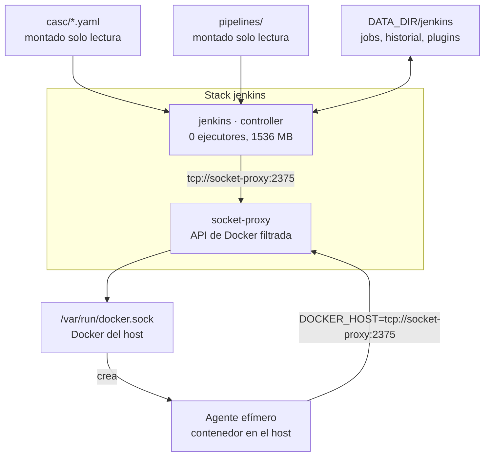
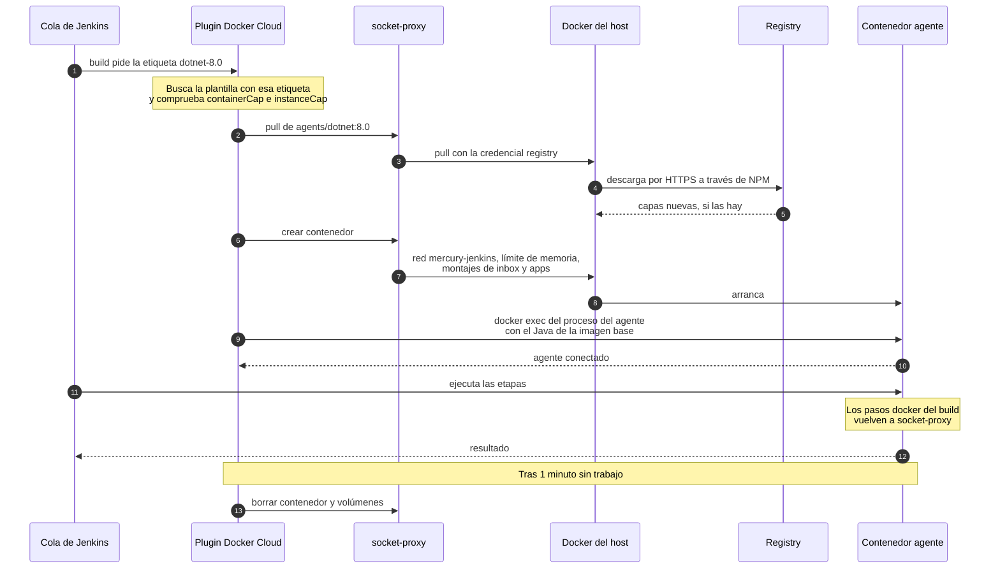
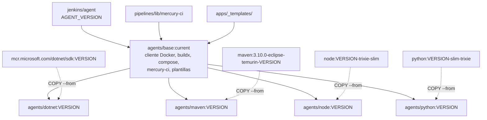
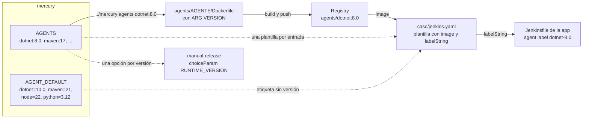
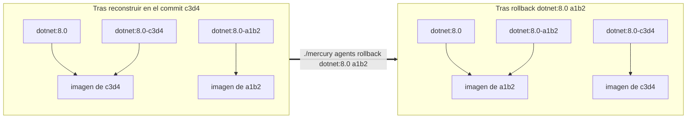

# 8. Jenkins y agentes

Cómo arranca Jenkins ya configurado, cómo nace y muere un agente, y cómo se construyen, versionan y revierten las imágenes de agente.

## Piezas del stack



| Pieza | Papel |
|---|---|
| `jenkins` | Controller. Planifica y muestra resultados. `numExecutors: 0` y `mode: EXCLUSIVE`: nunca ejecuta un build |
| `socket-proxy` | Único contenedor del stack con acceso al socket de Docker. Jenkins y los agentes le hablan por TCP dentro de `mercury-jenkins` |
| Agentes | Contenedores que el plugin Docker Cloud crea para cada build y destruye al terminar |

### Imagen del controller

`stacks/devops/jenkins/Dockerfile` parte de `jenkins/jenkins:${JENKINS_VERSION}` e instala los plugins de `plugins.txt` con `jenkins-plugin-cli`. La imagen resultante se etiqueta `mercury/jenkins:${JENKINS_VERSION}` y solo existe en el host (no va al registry). Llevar los plugins dentro de la imagen hace que el controller arranque igual en cualquier máquina.

Plugins de los que depende el funcionamiento:

| Plugin | Lo necesita |
|---|---|
| `configuration-as-code` | Cargar `casc/*.yaml` al arrancar |
| `job-dsl` | Crear las carpetas y el job `manual-release` desde `casc/jenkins.yaml` |
| `docker-plugin` | La nube Docker que crea los agentes |
| `workflow-aggregator` | Pipelines declarativos |
| `git`, `github-branch-source` | Leer los repos de las apps |
| `credentials-binding`, `plain-credentials` | `credentials('registry')`, el token de SonarQube |
| `sonar` | `withSonarQubeEnv` y `waitForQualityGate` |
| `lockable-resources` | `lock(...)` en `manual-release` |
| `pipeline-input-step` | La etapa *Aprobar prod* |
| `timestamper` | `timestamps()` en todas las plantillas |
| `prometheus` | El endpoint `/prometheus/` que lee Prometheus |

Los plugins van con `:latest`: se resuelve la última versión compatible en el momento de `./mercury build jenkins`. Dos construcciones en fechas distintas pueden dar plugins distintos.

### Variables de arranque del controller

| Variable | Efecto |
|---|---|
| `JAVA_OPTS: -Xmx768m` | Heap acotado dentro del límite de 1536 MB |
| `-Djenkins.install.runSetupWizard=false` | Sin asistente inicial: la configuración llega por JCasC |
| `-Dhudson.slaves.NodeProvisioner.initialDelay=0`, `MARGIN=50`, `MARGIN0=0.85` | Crear el agente en cuanto hay un build en cola, sin esperar a que la carga media lo justifique |
| `CASC_JENKINS_CONFIG=/usr/share/jenkins/casc` | Carpeta de la que JCasC carga todos los YAML |
| `CASC_YAML_MAX_ALIASES=200` | `jenkins.yaml` reutiliza bloques con anclas; el límite por defecto es 50 |
| `INT_DOMAIN`, `REGISTRY_HOST`, `INBOX_DIR`, `APPS_DIR`, `JENKINS_MAX_AGENTS`, `JENKINS_ADMIN_*`, `REGISTRY_USER`, `REGISTRY_PASSWORD`, `SONAR_TOKEN` | Valores que los YAML de `casc/` sustituyen con `${...}` |

### Permisos de `socket-proxy`

Cada variable a `1` habilita una familia de llamadas a la API de Docker:

| Variable | La necesita |
|---|---|
| `CONTAINERS`, `POST` | Crear, arrancar y borrar agentes, escáneres y apps |
| `EXEC` | Arrancar el proceso del agente dentro del contenedor (conector *attach*) |
| `IMAGES`, `DISTRIBUTION`, `AUTH` | `pull`, `push`, `login` y consulta de manifiestos |
| `NETWORKS`, `VOLUMES` | Conectar contenedores a redes; la caché de Trivy |
| `INFO` | `docker version` e `info` |
| `BUILD`, `SESSION`, `GRPC` | `docker buildx build` con BuildKit |

Filtrar no equivale a aislar: poder crear contenedores sigue siendo poder montar cualquier ruta del host.

## Configuración como código

Jenkins carga todos los YAML de `stacks/devops/jenkins/casc/`:

| Archivo | Contiene |
|---|---|
| `jenkins.yaml` | Usuario administrador, autorización, nube Docker y plantillas de agente, URL, conexión con SonarQube, carpetas y el job `manual-release` |
| `credentials.yaml` | Credenciales, agrupadas en dominios por proveedor |

Reglas de escritura:

- **`${VAR}` lo sustituye JCasC** con las variables de entorno del controller, en cualquier parte del YAML, también dentro de los scripts de `jobs:`. Por eso el Groovy de job-dsl no puede usar `${...}` para sus propias variables.
- **Bloques comunes con anclas YAML.** Las claves raíz `x-agent` y `x-agent-base` definen lo que comparten todas las plantillas de agente; cada plantilla las incorpora con `<<: *agent` y `<<: *agent-base` y añade solo `name`, `labelString`, `image` y memoria.
- **Los cambios hechos en la interfaz se pierden al reiniciar.** Esto incluye las credenciales creadas a mano.
- **Lo que no está en el repo y sí persiste**: los jobs de cada app, creados a mano dentro de las carpetas, y su historial. Viven en `DATA_DIR/jenkins`.

### Carpetas

El mapa `carpetas` de `jenkins.yaml` crea una carpeta por tecnología y framework (`dotnet`, `java/spring`, `javascript/angular`...). Los padres van antes que los hijos. El script solo crea o actualiza las carpetas: los jobs que haya dentro se conservan. La carpeta solo ordena; qué agente y qué empaquetado se usan lo decide el Jenkinsfile.

### Job `manual-release`

Se define en `jenkins.yaml` con job-dsl. Sus parámetros (`APP`, `RUNTIME`, `RUNTIME_VERSION`, `TARGET_ENV`) están ahí, no en el Jenkinsfile. El cuerpo del pipeline se lee de `/usr/share/jenkins/pipelines/manual-release/Jenkinsfile`, que es la carpeta `pipelines/` del repo montada en el controller. El archivo se lee cuando job-dsl procesa el YAML, es decir, al arrancar o recargar la configuración: tras editar ese Jenkinsfile hay que ejecutar `./mercury restart jenkins`.

### Aplicar cambios

| Cambio en | Comando | Por qué |
|---|---|---|
| `casc/*.yaml` | `./mercury restart jenkins` | El YAML va montado; `up` no recrea el contenedor si no cambió el compose ni un `.env` |
| `.env` o `credentials.env` del stack | `./mercury up jenkins` | Las variables de entorno solo cambian recreando el contenedor |
| `plugins.txt` o `JENKINS_VERSION` | `./mercury build jenkins && ./mercury up jenkins` | Los plugins van dentro de la imagen |
| `pipelines/manual-release/Jenkinsfile` | `./mercury restart jenkins` | Se lee al procesar job-dsl |

También se puede recargar sin reiniciar desde *Administrar Jenkins > Configuration as Code > Reload*.

## Credenciales

```
Credenciales de Jenkins
├── (global)   registry, sonar-token     las usa la plataforma: sus ID no se cambian
├── GitHub     github-mercury, ...       dominio con hostname github.com
└── GitLab     gitlab-mercury, ...       dominio con hostname gitlab.com
```

| Credencial | Origen del valor | Quién la usa |
|---|---|---|
| `registry` | `REGISTRY_USER` y `REGISTRY_PASSWORD` del `.env` del stack | Jenkins al descargar la imagen del agente (`pullCredentialsId`); `mercury-ci login` |
| `sonar-token` | `SONAR_TOKEN` del `.env` del stack | `withSonarQubeEnv('sonarqube')` |
| `<proveedor>-<dueño>` | Par `*_USER` y `*_TOKEN` de `credentials.env` | El checkout del repo de cada app |

Un dominio con `hostnameSpecification` hace que, al configurar un job, solo se ofrezcan las credenciales cuyo dominio coincide con la URL del repo. Ordena y filtra, pero no aísla: un Jenkinsfile puede pedir cualquier ID.

Cómo añadir una cuenta y cómo usarla en un pipeline: [03-despliegues.md](../instalacion/03-despliegues.md#credenciales-de-git).

## Ciclo de vida de un agente



Qué fija cada parámetro, todos en el ancla `x-agent` o `x-agent-base` de `casc/jenkins.yaml`:

| Parámetro | Valor | Efecto |
|---|---|---|
| `containerCap` | `${JENKINS_MAX_AGENTS}` | Máximo de agentes simultáneos en todo el servidor |
| `instanceCapStr` | `2` | Máximo de agentes simultáneos de una misma plantilla |
| `pullStrategy` | `PULL_ALWAYS` | La etiqueta de versión es móvil: se comprueba en cada build |
| `pullCredentialsId` | `registry` | Con qué usuario se descarga la imagen |
| `pullTimeout` | `600` | Segundos de margen para una primera descarga |
| `connector.attach` | `user: jenkins`, `javaExe: /opt/java/openjdk/bin/java` | El agente se arranca con `docker exec`; no necesita puerto de entrada en el controller |
| `retentionStrategy.idleMinutes` | `1` | Un agente ocioso se elimina al minuto |
| `removeVolumes` | `true` | No quedan volúmenes anónimos tras el build |
| `remoteFs` | `/home/jenkins/agent` | Ahí está el *workspace* |
| `network` | `mercury-jenkins` | Para alcanzar `socket-proxy` |
| `environmentsString` | `DOCKER_HOST`, `REGISTRY_HOST` | Lo que `mercury-ci` necesita |
| `mounts` | `INBOX_DIR` → `/inbox` y `APPS_DIR` → `/srv/mercury/apps`, ambos solo lectura | Canal manual y lectura de `<app>.env` al desplegar |
| `memoryLimit` = `memorySwap` | 2048, 1536 o 1024 MB | Límite de RAM sin swap adicional |

**`javaExe`.** El proceso del agente de Jenkins necesita un Java reciente. En las imágenes `maven-8` y `maven-11` el JDK del `PATH` es el del proyecto, demasiado antiguo para él. Por eso el agente arranca siempre con el Java de la imagen base (`/opt/java/openjdk`) y el JDK del proyecto se instala aparte, en `/opt/jdk`.

**Si la imagen no está publicada**, el build se queda en *Waiting for next available executor* hasta que se publique. No hay que reiniciar Jenkins.

## Imágenes de agente

### Cadena de construcción



Todas las imágenes de lenguaje siguen el mismo patrón multi-etapa: parten de la base y copian las herramientas desde la imagen oficial del lenguaje. Así cada agente tiene a la vez el cliente Docker, `mercury-ci` y su SDK.

| Imagen | Parte de | Añade | Exporta |
|---|---|---|---|
| `agents/base` | `jenkins/agent:${AGENT_VERSION}` | `git`, `curl`, `jq`, `unzip`, `docker-ce-cli`, `docker-buildx-plugin`, `docker-compose-plugin`, `/usr/local/bin/mercury-ci`, `/opt/mercury/templates` | — |
| `agents/dotnet` | base | `/usr/share/dotnet` del SDK, `libicu-dev`, la herramienta global `dotnet-sonarscanner` | `RUNTIME_VERSION` |
| `agents/maven` | base | JDK en `/opt/jdk` y Maven en `/usr/share/maven`; `JAVA_HOME=/opt/jdk` y el JDK primero en el `PATH` | `RUNTIME_VERSION` |
| `agents/node` | base | `node`, `npm` y `npx` en `/usr/local` | `RUNTIME_VERSION` |
| `agents/python` | base | El intérprete oficial en `/usr/local`; el `python3` de Debian solo aporta las librerías del sistema | `RUNTIME_VERSION` |

Dos consecuencias del diseño de la base:

- **El contexto de build de la base es la raíz del repo**, filtrada por `.dockerignore` para que solo viajen `pipelines/lib` y `apps/_templates`. Cualquier otra ruta que se quiera copiar a la imagen hay que añadirla a `.dockerignore`.
- **`mercury-ci` y las plantillas van dentro de la imagen.** Editarlos no tiene efecto hasta reconstruir la base y los agentes que heredan de ella: `./mercury agents`. Ver [scripts/01-como-se-aplican-los-cambios.md](../scripts/01-como-se-aplican-los-cambios.md).

### Catálogo y etiquetas



Una versión de agente existe en cuatro sitios, que hay que mantener de acuerdo:

| Sitio | Qué contiene |
|---|---|
| Lista `AGENTS` de `mercury` | La entrada `<agente>:<versión>` |
| `stacks/devops/jenkins/agents/<agente>/Dockerfile` | La receta, parametrizada con `ARG VERSION` |
| Plantilla en `casc/jenkins.yaml` | `image` (la del registry) y `labelString` (`<agente>-<versión>`) |
| `choiceParam` `RUNTIME_VERSION` de `manual-release` | La versión como opción del canal manual |

| Agente | Versiones | Por defecto | Etiquetas de Jenkins |
|---|---|---|---|
| `base` | única (`current`) | — | `base` |
| `dotnet` | 8.0, 9.0, 10.0 | 10.0 | `dotnet-8.0`, `dotnet-9.0`, `dotnet-10.0` y `dotnet` |
| `maven` | 8, 11, 17, 21, 25 | 21 | `maven-8` … `maven-25` y `maven` |
| `node` | 20, 22, 24 | 22 | `node-20`, `node-22`, `node-24` y `node` |
| `python` | 3.11, 3.12, 3.13 | 3.12 | `python-3.11`, `python-3.12`, `python-3.13` y `python` |

La versión por defecto lleva dos etiquetas de Jenkins: la versionada y la del nombre solo (`labelString: "dotnet-10.0 dotnet"`). Las plantillas Jenkinsfile usan la segunda. Cambiar la versión por defecto son dos pasos: `AGENT_DEFAULT` en `mercury` y mover la etiqueta sin versión a otra plantilla en `casc/jenkins.yaml`.

**Estar en el catálogo no significa estar construido.** Solo se publica lo que se pide. `./mercury agents list` muestra el catálogo y qué hay publicado.

### Etiquetas de imagen y vuelta atrás

Cada construcción publica dos etiquetas:

| Etiqueta | Ejemplo | Comportamiento |
|---|---|---|
| De versión, móvil | `agents/dotnet:8.0`, `agents/base:current` | Es la que usa Jenkins. Cada construcción la reasigna |
| Con commit, fija | `agents/dotnet:8.0-a1b2c3d`, `agents/base:a1b2c3d` | No se reasigna. Identifica el commit del repo de infraestructura con el que se construyó |

El commit es `git rev-parse --short HEAD` del repo de Mercury. Si hay cambios sin confirmar, se añade `-dirty`. La imagen lleva además la etiqueta OCI `org.opencontainers.image.revision`.



`rollback` descarga la etiqueta fija, la reetiqueta como la móvil y la publica. Como los agentes usan `PULL_ALWAYS`, el siguiente build ya usa la imagen anterior, sin reiniciar nada.

### Qué construye cada forma de `./mercury agents`

| Comando | Construye |
|---|---|
| `./mercury agents list` | Nada. Muestra el catálogo y el estado en el registry |
| `./mercury agents dotnet:8.0` | Ese agente. La base, solo si no existe ni en local ni en el registry |
| `./mercury agents dotnet` | La versión por defecto de `dotnet` |
| `./mercury agents base` | Solo la base |
| `./mercury agents base dotnet maven node python` | La base y la versión por defecto de cada lenguaje (instalación inicial) |
| `./mercury agents` | La base y **todos los agentes ya publicados**, que heredan de ella |
| `./mercury agents rollback <agente>:<versión> <commit>` | Nada. Reasigna la etiqueta móvil |

Requisitos: el `.env` de Jenkins (de ahí sale `AGENT_VERSION`) y una sesión iniciada en el registry desde el host (`docker login`), porque el estado *publicada* se consulta con `docker manifest inspect`. Todos los argumentos se validan contra el catálogo antes de construir nada.

Cada reconstrucción deja una etiqueta fija más en el registry. La limpieza está en [10-registry-e-imagenes.md](10-registry-e-imagenes.md#limpieza).

## Concurrencia

| Nivel | Regla | Dónde |
|---|---|---|
| Servidor | Como mucho `JENKINS_MAX_AGENTS` agentes a la vez; el siguiente build espera en cola | `containerCap` |
| Plantilla | Como mucho 2 agentes de la misma plantilla | `instanceCapStr` |
| Job de una app | Un solo build; uno nuevo cancela al anterior, también si esperaba aprobación | `disableConcurrentBuilds(abortPrevious: true)` en cada plantilla Jenkinsfile |
| `manual-release` | Varias ejecuciones a la vez; se serializan solo los despliegues de la misma app y ambiente | `lock("deploy-<app>-<env>")` |
| Aprobación de prod | La espera no ocupa agente ni memoria | Etapa con `agent none` |
| Trivy | Si dos builds actualizan su base de datos a la vez, uno falla y se reintenta hasta 3 veces | `trivy_retry` en `mercury-ci` |
