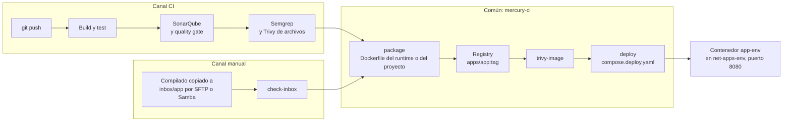
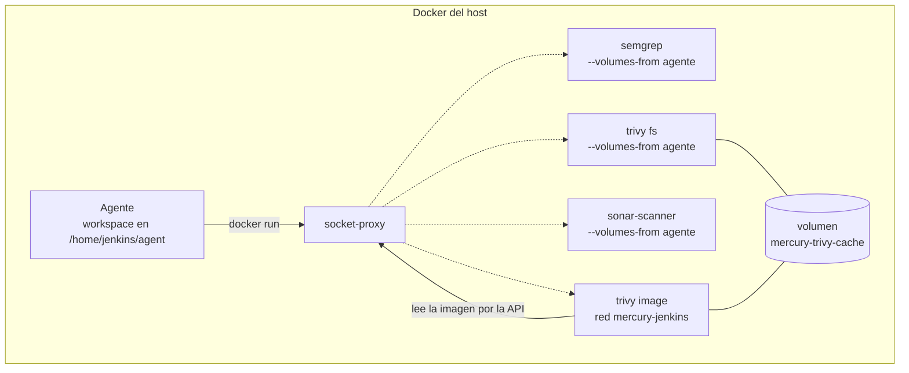
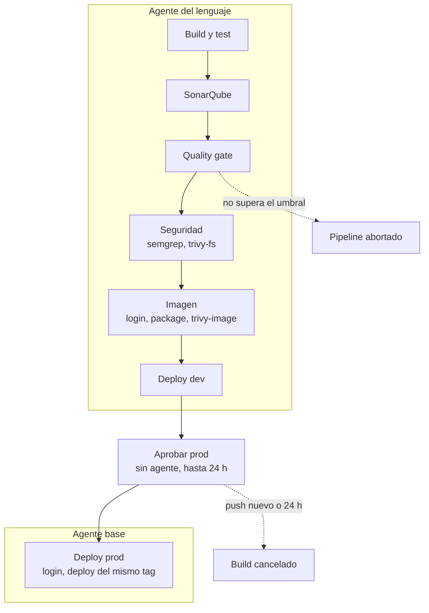
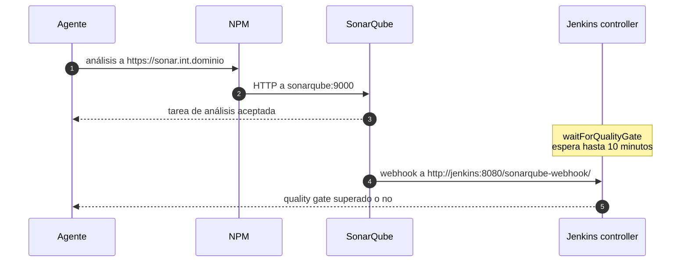
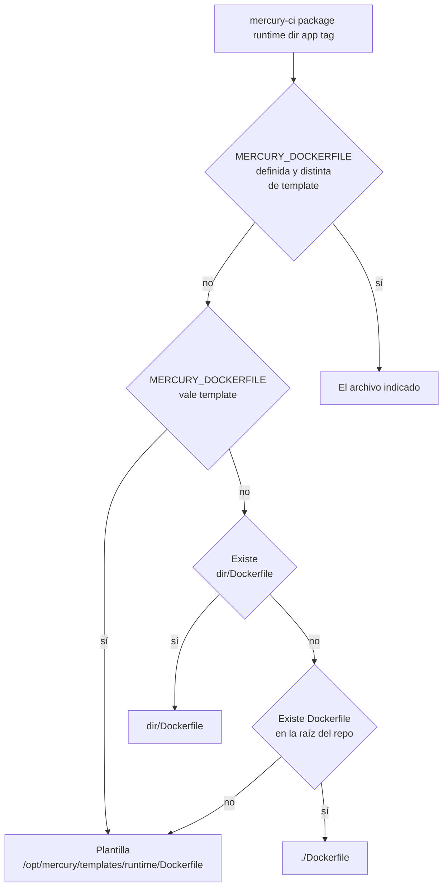
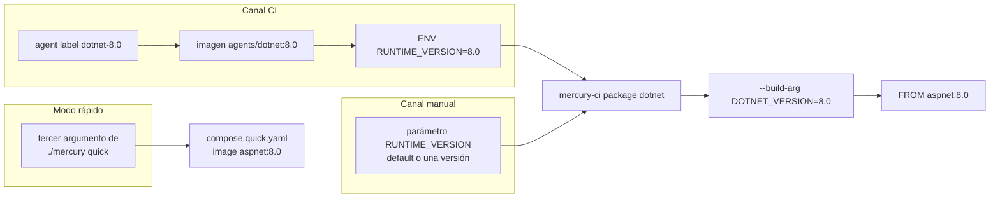
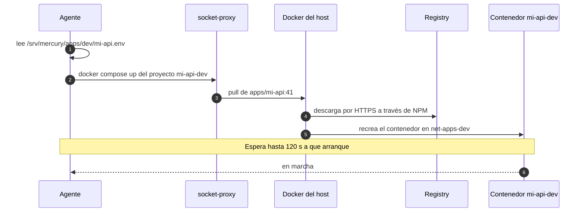
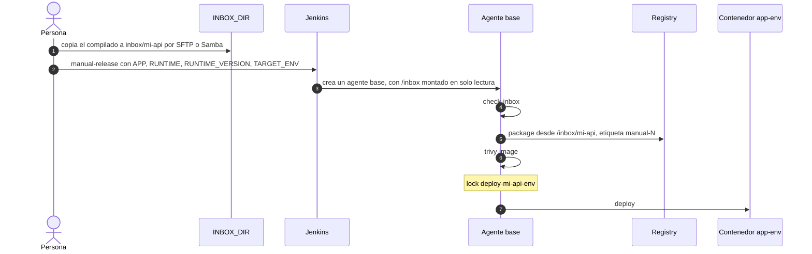

# 9. Pipelines y despliegue

Qué hace cada etapa, cómo se empaqueta una app y cómo llega a `dev` y a `prod`. La guía práctica (qué copiar, qué pulsar) está en [03-despliegues.md](../instalacion/03-despliegues.md); este documento explica el mecanismo.

## Dos canales, un mismo final



Los dos canales convergen en `mercury-ci package`. La razón es que el `Dockerfile` de cada runtime **empaqueta un compilado ya hecho, no compila**: da igual que el compilado venga de un agente o de la PC de alguien.

| | Canal CI | Canal manual |
|---|---|---|
| Entrada | Código en un repo de git | Compilado en `INBOX_DIR/<app>` |
| Quién compila | El agente del lenguaje | La persona, en su PC |
| Análisis de código | SonarQube, Semgrep, Trivy de archivos | Ninguno |
| Escaneo de imagen | Trivy | Trivy |
| Etiqueta de la imagen | Número de build (`41`) | `manual-<número de build>` |
| Ambiente | `dev` siempre; `prod` tras aprobación | El que se elija en el parámetro |
| Definición | `Jenkinsfile` en el repo de la app | `pipelines/manual-release/Jenkinsfile` en este repo |

## `mercury-ci`

`pipelines/lib/mercury-ci` es el único lugar con la lógica de escaneo, empaquetado y despliegue. Los Jenkinsfile solo lo invocan. Va instalado en `/usr/local/bin/mercury-ci` dentro de la imagen base de agentes.

| Paso | Qué hace |
|---|---|
| `login` | `docker login` en el registry con `REGISTRY_USR` y `REGISTRY_PSW` (los expone `credentials('registry')`) |
| `image-ref <app> <tag>` | Imprime `<REGISTRY_HOST>/apps/<app>:<tag>` |
| `check-inbox <app>` | Valida que `/inbox/<app>` existe y no está vacía |
| `sonar <clave> [args]` | Análisis con el contenedor `sonar-scanner-cli` sobre el directorio actual |
| `semgrep` | SAST del directorio actual; deja el informe en `semgrep.json` |
| `trivy-fs` | Dependencias vulnerables, secretos y mala configuración del directorio actual |
| `package <runtime> <dir> <app> <tag>` | Elige el Dockerfile, construye la imagen y la publica |
| `trivy-image <imagen>` | Vulnerabilidades de la imagen final |
| `deploy <app> <dev\|prod> <tag>` | Despliega la imagen con `compose.deploy.yaml` |

Las variables que ajustan su comportamiento están en [12-referencia.md](12-referencia.md#variables-de-mercury-ci-y-de-los-jenkinsfile).

### Por qué los escáneres son contenedores hermanos

Los agentes no tienen Docker dentro: su `DOCKER_HOST` apunta a `socket-proxy`, de modo que cualquier `docker run` lo ejecuta el Docker del host. De ahí salen tres reglas que explican cómo está escrito `mercury-ci`:

| Situación | Qué ocurre | Cómo se resuelve |
|---|---|---|
| `docker run -v /ruta:/x` desde un agente | Monta `/ruta` **del host**, no del agente | No se usa `-v` para el *workspace* |
| Un escáner necesita ver el código | El código está en el sistema de archivos del agente | `--volumes-from <id del agente>`; el ID es el `hostname` del contenedor |
| `docker build <dir>` desde un agente | El cliente empaqueta `<dir>` y lo envía al daemon | Funciona sin más: el contexto viaja por la API |
| `docker compose` lee `env_file` | Lo lee el cliente, dentro del agente | `APPS_DIR` va montado en el agente en la misma ruta que en el host |



- Cada escáner lleva `--memory 1536m` (`MERCURY_SCAN_MEMORY`): corre fuera del límite del agente y, sin tope propio, dos builds simultáneos podrían agotar la RAM.
- Semgrep se ejecuta con el mismo UID que el agente, para que git reconozca el repo y el informe quede con su dueño.
- `trivy-image` no monta el *workspace*: se conecta a `mercury-jenkins` y lee la imagen a través de `socket-proxy`.
- La base de datos de Trivy vive en el volumen `mercury-trivy-cache`, compartido entre builds. Es el único volumen con nombre del proyecto.

### Modo informativo y modo estricto

Por defecto los escáneres informan y no rompen el build. Con `MERCURY_SCAN_STRICT = '1'` en el `environment` del Jenkinsfile:

| Escáner | Modo informativo | Modo estricto |
|---|---|---|
| Semgrep | Sale con 0 aunque haya hallazgos | Se añade `--error`: los hallazgos rompen el build |
| Trivy | `--exit-code 0` | `--exit-code 10`: los hallazgos de severidad `HIGH,CRITICAL` rompen el build, sin reintento |

El *quality gate* de SonarQube es independiente: siempre detiene el pipeline si no se supera.

## Canal CI

### Etapas



Las plantillas declaran `agent none` en el pipeline y asignan agente por etapa. Así la espera de aprobación no ocupa memoria ni un cupo de agente. *Deploy prod* usa el agente `base`, el más ligero, y `skipDefaultCheckout()`: no necesita el código, solo desplegar una imagen que ya existe.

**Prod recibe la misma imagen que se probó en dev.** No se reconstruye: `mercury-ci deploy "$APP" prod "$TAG"` usa el mismo `TAG`.

### Qué cambia entre lenguajes

| Plantilla | Agente | Build y test | Análisis SonarQube | Qué se empaqueta | Runtime |
|---|---|---|---|---|---|
| `dotnet/Jenkinsfile` | `dotnet` | `dotnet restore`, `build`, `test` | `dotnet sonarscanner begin` … `end`, que envuelve la compilación | `publish/` (de `dotnet publish`) | `dotnet` |
| `spring/Jenkinsfile` | `maven` | `mvn -B verify` | `mvn sonar:sonar` (necesita Java 17 o superior) | `release/` con el único `.jar` | `spring` |
| `flask/Jenkinsfile` | `python` | `venv`, `pip install`, `pytest` | `mercury-ci sonar` | `.` (el código) | `flask` |
| `node/Jenkinsfile` | `node` | `npm ci`, `build` y `test` si existen | `mercury-ci sonar` | `.` (el código) | `node` |
| `spa/Jenkinsfile.angular` | `node` | `npm ci`, `npm run build` | `mercury-ci sonar` | `DIST_DIR` | `spa` |
| `spa/Jenkinsfile.react` | `node` | Lo anterior y `npm test` si existe | `mercury-ci sonar` | `DIST_DIR` | `spa` |
| `spa/Jenkinsfile.vue` | `node` | Lo anterior y `npm run test:unit` si existe | `mercury-ci sonar` | `DIST_DIR` | `spa` |
| `static/Jenkinsfile` | `base` | — | `mercury-ci sonar` | `SITE_DIR` | `static` |

Particularidades:

- **.NET** usa su propio escáner (`dotnet-sonarscanner`, instalado en la imagen del agente) porque necesita envolver la compilación.
- **Maven con Java 8 u 11**: el plugin de SonarQube para Maven exige Java 17. La plantilla trae comentada la alternativa con `mercury-ci sonar`.
- **Flask**: `pytest` devuelve 5 cuando no encuentra tests y no se considera fallo. El `.venv` se borra antes de los escáneres para no analizar dependencias instaladas.
- **Angular** no ejecuta tests: `ng test` necesita un navegador que el agente no tiene.

### Comunicación con SonarQube



La ida pasa por NPM porque el agente no comparte red con SonarQube. La vuelta es directa: SonarQube y el controller están ambos en `net-tools`. Ese webhook se crea a mano en SonarQube; si falta, la etapa *Quality gate* agota sus 10 minutos.

`withSonarQubeEnv('sonarqube')` inyecta `SONAR_HOST_URL` y `SONAR_AUTH_TOKEN` a partir de la instalación `sonarqube` definida en `casc/jenkins.yaml` y de la credencial `sonar-token`.

## Empaquetado

### Qué Dockerfile se usa



El Dockerfile del proyecto gana a la plantilla. `package` escribe en el log cuál eligió, su origen, el contexto y la versión del runtime. Si `MERCURY_DOCKERFILE` apunta a un archivo que no existe, o el runtime no tiene plantilla, el paso falla.

Sea cual sea, la imagen debe escuchar en el puerto 8080 y conviene que termine con un usuario sin privilegios.

### La versión del runtime sigue al agente



Cada imagen de agente exporta `RUNTIME_VERSION`. `mercury-ci package` la traduce al `ARG` del Dockerfile del runtime:

| Runtime | `ARG` | Imagen de ejecución | Por defecto |
|---|---|---|---|
| `dotnet` | `DOTNET_VERSION` | `mcr.microsoft.com/dotnet/aspnet:<versión>` | 10.0 |
| `spring` | `JAVA_VERSION` | `eclipse-temurin:<versión>-jre` | 21 |
| `node` | `NODE_VERSION` | `node:<versión>-alpine` | 22 |
| `flask` | `PYTHON_VERSION` | `python:<versión>-slim` | 3.12 |
| `static`, `spa` | ninguno | `nginxinc/nginx-unprivileged:1.30-alpine` | — |

- Si `RUNTIME_VERSION` está vacía o vale `default`, no se pasa `--build-arg` y manda el valor por defecto del Dockerfile.
- En `static` y `spa` la versión se ignora: un Angular compilado con `node-24` se sirve con nginx.
- Un Dockerfile propio sigue al agente solo si declara el mismo `ARG`.
- El valor por defecto de cada `ARG` debe coincidir con `AGENT_DEFAULT` de `mercury`. Al cambiar la versión por defecto de un agente, cambia también el `ARG` de su Dockerfile y el valor por defecto de su `compose.quick.yaml`.

### Plantillas de runtime

| Runtime | Contexto esperado | Arranque | Usuario | Requisito de la app |
|---|---|---|---|---|
| `dotnet` | Salida de `dotnet publish` | `dotnet <dll>`; el ensamblado se deduce del único `*.runtimeconfig.json`, o se fija con `APP_DLL` | `$APP_UID` | Ninguno: `ASPNETCORE_HTTP_PORTS=8080` |
| `spring` | Carpeta con un único `.jar` | `java $JAVA_OPTS -jar app.jar`, con `MaxRAMPercentage=75` | 10001 | Ninguno: `SERVER_PORT=8080` |
| `flask` | Código con `requirements.txt` | `gunicorn --bind 0.0.0.0:8080 --workers 2 $APP_MODULE` | 10001 | Objeto Flask en `app:app`, o definir `APP_MODULE` |
| `node` | Código con `package.json` | `npm start`, tras `npm ci --omit=dev` | `node` | Escuchar en `process.env.PORT`; script `start` |
| `static` | Carpeta con `index.html` | nginx | sin privilegios | — |
| `spa` | Carpeta compilada con `index.html` | nginx con `try_files $uri $uri/ /index.html` | sin privilegios | — |

La diferencia entre `static` y `spa` es esa línea `try_files`: en `spa`, lo que no es un archivo devuelve `index.html`, para que recargar una ruta interna (`/clientes/5`) no dé 404.

Los runtimes `flask`, `node`, `static` y `spa` traen un `Dockerfile.dockerignore` junto a su `Dockerfile`. BuildKit lo aplica automáticamente y evita que entren en la imagen `.git`, `node_modules`, entornos virtuales o informes de los escáneres.

`package` construye con `docker buildx build --pull --load` y después hace `docker push`. `--load` deja la imagen en el almacén local del daemon, que es donde `push` y `trivy-image` la buscan.

## Despliegue

`apps/_templates/compose.deploy.yaml` es el único compose de despliegue, para cualquier runtime y ambos canales:

| Elemento | Valor | Consecuencia |
|---|---|---|
| `name:` | `<app>-<env>` | Cada app y ambiente es un proyecto compose propio |
| `container_name` | `<app>-<env>` | NPM y el túnel apuntan siempre al mismo nombre |
| `image` | `<REGISTRY_HOST>/apps/<app>:<tag>` | La imagen exacta que se construyó |
| `env_file` | `APPS_DIR/<env>/<app>.env`, opcional | Configuración y secretos por ambiente, fuera de git y de la imagen |
| red | `net-apps-<env>`, externa | Aislamiento entre dev y prod |
| `mem_limit` | `APP_MEM_LIMIT`, 512 MB por defecto | Ninguna app sin límite |
| `no-new-privileges` | activado | — |

Tanto `mercury-ci deploy` como `./mercury deploy` ejecutan:

```bash
docker compose -f compose.deploy.yaml up -d --pull always --wait --wait-timeout 120
```

- `--pull always`: se descarga la imagen del registry aunque exista una local con esa etiqueta.
- `--wait --wait-timeout 120`: el despliegue falla si el contenedor no queda en marcha en 120 segundos. Es la causa habitual de un *Deploy dev* fallido: la app no arranca, casi siempre por configuración que falta en su `<app>.env`.
- Como el nombre de proyecto y de contenedor no cambian, un despliegue nuevo **reemplaza** al anterior. No hay dos versiones a la vez ni despliegue gradual: hay un corte breve.



### Configuración de una app

`APPS_DIR/<env>/<app>.env` contiene las variables de entorno de esa app en ese ambiente. Lo crea a mano quien administra el servidor y se aplica en el siguiente despliegue. Debe ser legible por el UID 1000 (el usuario `jenkins` del agente), que es quien lo lee al ejecutar compose.

### Volver a una versión anterior

Cada build deja su imagen en el registry, así que volver atrás es desplegar otra etiqueta:

```bash
./mercury deploy mi-api prod 41        # la imagen del build 41
./mercury undeploy mi-api dev          # retirar una app (docker compose -p mi-api-dev down)
```

`./mercury deploy` se ejecuta en el host y usa el mismo `compose.deploy.yaml`, así que el resultado es idéntico al de un pipeline.

## Canal manual



- El agente ve la carpeta porque todas las plantillas de agente montan `INBOX_DIR` en `/inbox`, en solo lectura.
- Si la carpeta incluye un `Dockerfile`, se usa ese (regla de prioridad de `package`).
- `RUNTIME_VERSION` es la versión con la que se compiló. `default` deja la del Dockerfile.
- El job no usa `disableConcurrentBuilds`: se pueden publicar apps distintas a la vez. El `lock` serializa solo los despliegues de la misma app y ambiente.

### Las dos puertas del inbox

| | SFTP | Samba |
|---|---|---|
| Servicio | `sshd` del host, puerto 22 | Contenedor `samba`, puerto 445 en `LAN_IP` |
| Usuario | `deployer` (contraseña con `sudo passwd deployer`) | `SAMBA_USER` y `SAMBA_PASSWORD` del `.env` de `files` |
| Escribe como | UID 2000, GID 2000 | UID 2000, GID 2000 |
| Ruta | `/inbox` dentro del chroot | `\\LAN_IP\inbox` |

Ambos escriben en `INBOX_DIR` con el mismo UID, así que se pueden alternar.

## Modo rápido

`./mercury quick <app> <runtime> [versión]` levanta el `compose.quick.yaml` del runtime: un contenedor con la imagen de ejecución oficial y la carpeta de inbox montada en solo lectura. No hay Jenkins, ni imagen, ni registry, ni escáneres.

| Runtime | Qué hace al arrancar | Hay que repetir el comando tras copiar |
|---|---|---|
| `dotnet` | Ejecuta el ensamblado de la carpeta | Sí |
| `spring` | Ejecuta el primer `.jar` | Sí |
| `flask` | Instala dependencias y arranca gunicorn | Sí |
| `node` | Copia el código a una carpeta escribible, `npm install`, `npm start` | Sí |
| `static` | nginx sirve la carpeta | No: los cambios se ven al instante |

- Solo existe para `dev` y solo para los runtimes de la lista `RUNTIMES` de `mercury`. `spa` no tiene: un SPA compilado se prueba con `static`, sin el retorno a `index.html`.
- Usa el mismo nombre de proyecto y de contenedor que un despliegue normal (`<app>-dev`), así que comparte Proxy Host en NPM. El último que se despliegue es el que queda.
- No lee `APPS_DIR/dev/<app>.env`.
