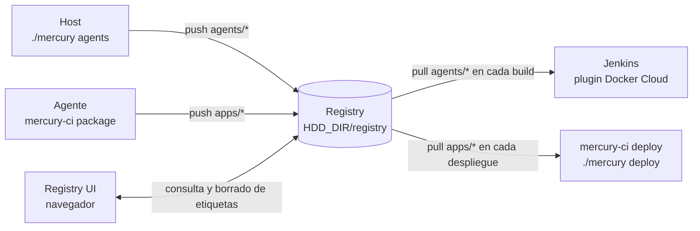
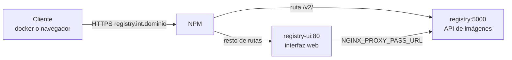
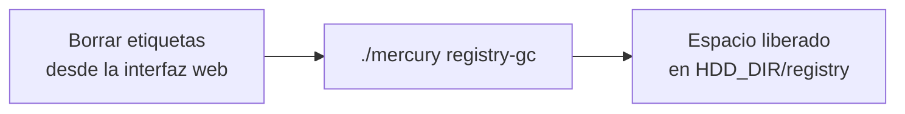

# 10. Registry e imágenes

Qué imágenes existen, cómo se nombran, quién las publica y quién las descarga.

## Papel del registry

El registry privado es el punto por el que pasa todo lo que se construye en el servidor:

Por eso es el primer stack de `devops` en arrancar y el primero que hay que tener en marcha: sin él Jenkins no puede crear agentes.

## Imágenes

| Repositorio | Etiquetas | La publica | La consume |
|---|---|---|---|
| `agents/base` | `current` (móvil) y `<commit>` (fija) | `./mercury agents base` | Los agentes de lenguaje, como `FROM`; Jenkins, para `manual-release`, `static` y *Deploy prod* |
| `agents/<agente>` | `<versión>` (móvil) y `<versión>-<commit>` (fija) | `./mercury agents <agente>:<versión>` | Jenkins, en cada build |
| `apps/<app>` | `<número de build>` | `mercury-ci package` en el canal CI | `mercury-ci deploy`, `./mercury deploy` |
| `apps/<app>` | `manual-<número de build>` | `mercury-ci package` en el canal manual | ídem |

El nombre completo lleva siempre el host delante: `registry.int.<dominio>/apps/mi-api:41`.

**Ninguna imagen usa `latest`.** Las de terceros llevan versión exacta en el `.env` de su stack; las propias, las etiquetas de la tabla. Así siempre se sabe qué se está ejecutando y se puede volver atrás.

Imágenes que **no** están en el registry:

| Imagen | Dónde vive | Por qué |
|---|---|---|
| `mercury/jenkins:<versión>` | Solo en el host | La construye `./mercury build jenkins` y solo la usa el compose de Jenkins |
| Imágenes de terceros (NPM, SonarQube, Grafana...) | Se descargan de sus registros públicos | No se replican |
| Imágenes de los escáneres | Se descargan de Docker Hub en el primer build | Fijadas por versión en `mercury-ci` |

### Numeración de las etiquetas de app

`TAG` es `BUILD_NUMBER` del job de Jenkins. Cada job tiene su propia numeración, y cada job publica en `apps/<APP>` según la variable `APP` de su Jenkinsfile. Dos jobs con el mismo `APP` se pisarían las etiquetas: el nombre de app debe ser único en el servidor. En el canal manual la numeración es la del job `manual-release`, compartida por todas las apps, con el prefijo `manual-`.

## Acceso

El registry no publica ningún puerto. Se llega a él siempre por NPM, con HTTPS:

El Proxy Host `registry.int.<dominio>` necesita tres cosas, que se configuran a mano en NPM:

| Ajuste | Motivo |
|---|---|
| Destino por defecto `registry-ui:80` | La interfaz web |
| *Custom location* `/v2/` → `registry:5000` | La API que usan `docker pull` y `docker push` |
| `client_max_body_size 0;` en *Advanced* | Las capas de imagen superan el límite por defecto de nginx |

En el compose, `REGISTRY_HTTP_RELATIVEURLS: "true"` evita que el registry, que está detrás de un proxy que termina TLS, devuelva redirecciones a `http://`.

### Quién se conecta de verdad

Quien habla con el registry es siempre **el daemon de Docker del host**, no el cliente:

- Un `docker push` lanzado desde un agente llega al daemon a través de `socket-proxy`, y es el daemon quien abre la conexión HTTPS con el registry.
- Por eso el nombre `registry.int.<dominio>` tiene que resolverse **en el host**: es el segundo eslabón que comprueba `./mercury check-dns`.
- Las credenciales las guarda el cliente (`docker login` en el agente o en el host) y las envía al daemon en cada operación.

### Autenticación

Autenticación básica con un archivo `htpasswd` (bcrypt) en `DATA_DIR/registry/auth/htpasswd`, montado en solo lectura.

| Usuario | Se crea con | Se usa en |
|---|---|---|
| El de Jenkins (por defecto `jenkins`) | `./mercury registry-user jenkins` | `REGISTRY_USER` y `REGISTRY_PASSWORD` del `.env` de Jenkins → credencial `registry` |
| El de cada persona | `./mercury registry-user <usuario>` | `docker login` en el host y la interfaz web |

`./mercury registry-user` crea el archivo si no existe, o añade o actualiza el usuario si existe. Necesita `htpasswd` en el host (paquete `apache2-utils`, que instala `host/01-base.sh`).

No hay permisos por repositorio: cualquier usuario válido puede leer, publicar y borrar cualquier imagen.

## Almacenamiento

Las capas se guardan en `HDD_DIR/registry` (HDD). **No entran en el backup**: se pueden regenerar reconstruyendo los agentes y volviendo a lanzar los pipelines. Lo que sí se copia es el archivo de usuarios, que está en `DATA_DIR`.

## Limpieza

Cada build de una app y cada reconstrucción de un agente dejan una etiqueta más. El registry no borra nada por sí mismo.

1. Borra las etiquetas que sobran desde `https://registry.int.<dominio>`. Lo permiten `REGISTRY_STORAGE_DELETE_ENABLED` en el registry y `DELETE_IMAGES` en la interfaz.
2. `./mercury registry-gc` ejecuta `registry garbage-collect --delete-untagged`, que elimina las capas que ya no referencia ninguna etiqueta.

Borrar una etiqueta sin ejecutar el recolector no libera espacio.

Qué conservar:

- La etiqueta móvil de cada agente en uso y, al menos, la fija anterior, para poder revertir.
- La etiqueta de app desplegada en cada ambiente y las últimas a las que tendría sentido volver.

## Limpieza del host

El registry (HDD) no es el único sitio donde se acumulan imágenes. El Docker del host (SSD, `/var/lib/docker`) guarda su propia copia de todo lo que construye o descarga:

| Qué se acumula | Por qué | Cómo se limpia |
|---|---|---|
| Una imagen `apps/<app>:<n>` por build | `mercury-ci package` construye con `--load` | `./mercury prune` borra las que no usa ningún contenedor |
| Una etiqueta `agents/<agente>:<versión>-<commit>` por reconstrucción | `./mercury agents` | `./mercury prune` las borra; conserva las de versión y `base:current` |
| Imágenes sin etiqueta (`<none>`) | Un agente o una base reemplazados por una construcción nueva | `./mercury prune` |
| Caché de build de BuildKit, incluidas las cachés de `RUN --mount=type=cache` | Cada `docker build` | Tope de 10 GB (`builder.gc` en `daemon.json`) y `./mercury prune` para lo que tenga más de 7 días |
| Volúmenes `mercury-cache-*` y `mercury-trivy-cache` | Cachés de dependencias y base de datos de Trivy | `./mercury prune --caches` |
| Imágenes de stacks detenidos o de versiones anteriores | `./mercury down`, actualizaciones | `./mercury prune --all` |

`./mercury prune` es seguro de ejecutar en cualquier momento:

- Borrar la copia local de una imagen de app no pierde nada: está en el registry y un despliegue la vuelve a descargar (`--pull always`).
- Usa `docker rmi` sin `-f`, que se niega a borrar una imagen que esté usando un contenedor. Lo desplegado y lo que está en marcha no se toca.
- Si hay un build en marcha (un agente en la red `mercury-jenkins`), omite el borrado de imágenes de apps y agentes: ese build necesita su imagen recién construida hasta publicarla y escanearla.
- No toca el registry, ni los volúmenes de caché (salvo con `--caches`), ni las imágenes de stacks detenidos (salvo con `--all`).

`host/07-cleanup.sh` programa `./mercury prune` cada domingo a las 04:30 con un timer de systemd. Muestra `docker system df` antes y después; la salida queda en `journalctl -u mercury-prune.service`.

Lo que **no** es automático y sigue siendo manual: las etiquetas del registry (sección anterior) y las cachés de dependencias, que crecen sin límite hasta que se vacían.
