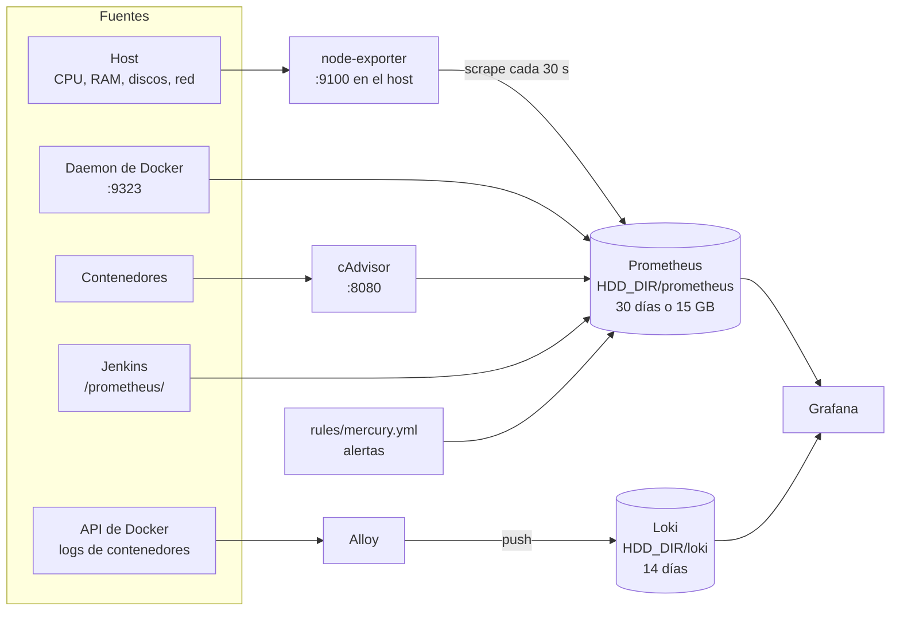
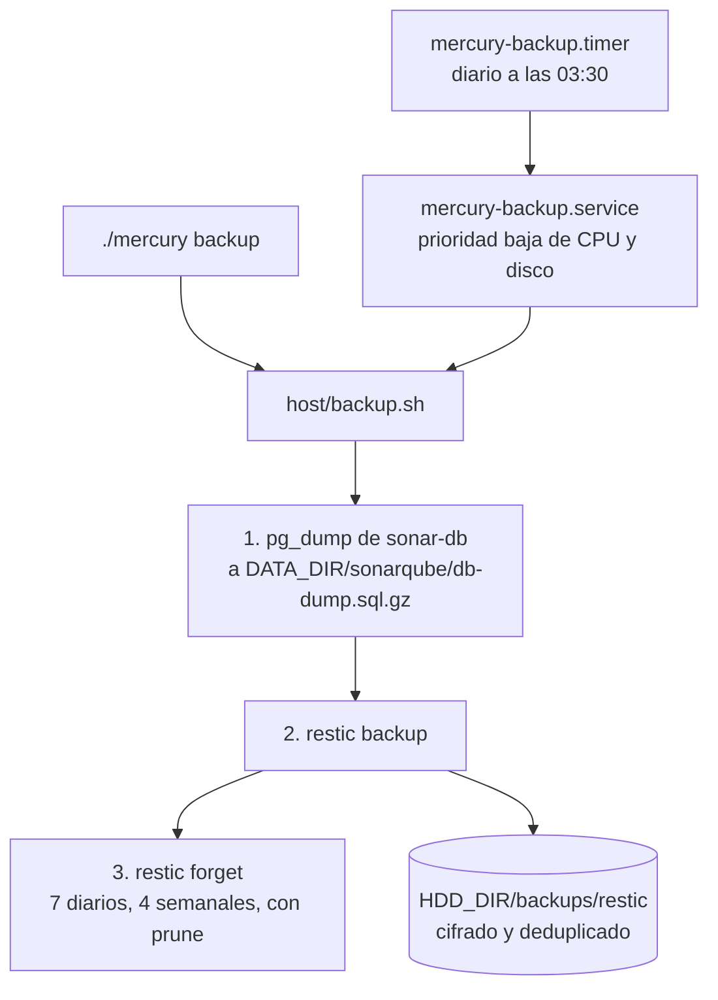

# 11. Observabilidad y backups

De dónde salen las métricas, los logs y las alertas, y qué se copia cada noche.

## Tres stacks independientes

| Stack | Servicios | Si no se levanta |
|---|---|---|
| `metrics` | Prometheus, node-exporter, cAdvisor | No hay métricas ni alertas |
| `logs` | Loki, Alloy | Los logs siguen en `docker logs`, sin búsqueda centralizada |
| `grafana` | Grafana | No hay paneles; Prometheus y Loki siguen recogiendo datos |

Los tres comparten la red interna `net-obs`. Se levantan juntos con `./mercury up monitoring` y se detienen juntos para liberar 1,9 GB.

## Métricas

Prometheus lee cada 30 segundos estos destinos, definidos en `stacks/monitoring/metrics/prometheus/prometheus.yml`:

| Job | Destino | Qué aporta | Por qué red llega |
|---|---|---|---|
| `prometheus` | `localhost:9090` | Sus propias métricas | — |
| `node` | `host.docker.internal:9100` | CPU, memoria, discos y red del host | Puerta de enlace del host |
| `docker` | `host.docker.internal:9323` | Métricas del daemon de Docker | Puerta de enlace del host |
| `cadvisor` | `cadvisor:8080` | CPU, memoria y red por contenedor | `net-obs` |
| `jenkins` | `jenkins:8080/prometheus/` | Builds, cola, ejecutores | `net-tools` |
| `loki` | `loki:3100` | Estado de Loki | `net-obs` |
| `alloy` | `alloy:12345` | Estado de Alloy | `net-obs` |
| `grafana` | `grafana:3000` | Estado de Grafana | `net-obs` |

Detalles que dependen de otras piezas:

- **node-exporter corre en la red del host** (`network_mode: host`, `pid: host`) para ver las interfaces y los discos reales. Prometheus lo alcanza por `host.docker.internal`, que el compose asocia a la puerta de enlace del host.
- **UFW solo deja llegar a 9100 y 9323 desde `10.200.0.0/16`**, el rango de las redes de Docker. Si se cambia ese rango en `daemon.json`, hay que cambiar `DOCKER_POOL` en `host/_common.sh` y repetir `host/01-base.sh`.
- **Las métricas del daemon** existen por `metrics-addr: 0.0.0.0:9323` en `daemon.json`.
- **Las métricas de Jenkins** existen por el plugin `prometheus` de `plugins.txt`.
- **cAdvisor es privilegiado** y monta `/`, `/sys` y `/var/lib/docker` en solo lectura. Se le desactivan las métricas más costosas para caber en 192 MB.
- **Prometheus no se publica** ni tiene Proxy Host. Sus *targets* se consultan desde el propio contenedor (ver [02-puesta-en-marcha.md](../instalacion/02-puesta-en-marcha.md#fase-6-monitoring)).

Retención: 30 días o 15 GB, lo que se alcance antes, en `HDD_DIR/prometheus`.

Las apps desplegadas no exponen métricas propias a Prometheus: de ellas se ve su consumo, a través de cAdvisor, y sus logs.

## Logs

Alloy descubre todos los contenedores por la API de Docker, lee su salida y la envía a Loki. No hay que configurar nada por contenedor: un servicio o una app nueva aparece sola.

Etiquetas que añade Alloy (`stacks/monitoring/logs/alloy/config.alloy`):

| Etiqueta | Sale de | Ejemplo de consulta |
|---|---|---|
| `container` | Nombre del contenedor | `{container="mi-api-prod"}` |
| `stack` | Proyecto compose | `{stack="jenkins"}` |
| `service` | Servicio compose | `{stack="sonarqube", service="sonar-db"}` |

Como cada app desplegada es un proyecto compose llamado `<app>-<env>`, sus logs se encuentran tanto por `container` como por `stack`.

Loki corre como un solo proceso con almacenamiento en disco (`HDD_DIR/loki`), sin autenticación, y conserva 14 días (`retention_period: 336h`).

Independientemente de Loki, Docker rota los logs de cada contenedor en el host: 3 archivos de 10 MB (`log-opts` en `daemon.json`). Sin esa rotación llenarían el disco.

## Grafana

Todo se carga desde archivos del repo, montados en solo lectura:

| Ruta | Contenido |
|---|---|
| `provisioning/datasources/datasources.yaml` | Fuentes `Prometheus` (uid `prometheus`, por defecto) y `Loki` (uid `loki`) |
| `provisioning/dashboards/dashboards.yaml` | Proveedor que carga `dashboards/` en la carpeta *Mercury*, cada 60 segundos |
| `dashboards/mercury-overview.json` | *Mercury - Resumen*: CPU, RAM, swap, discos, consumo por contenedor, errores recientes |
| `dashboards/community-*.json` | Dashboards de la comunidad. No se versionan |

- **Los uid fijos** permiten que los dashboards del repo referencien las fuentes de datos sin depender de un identificador generado.
- **`fetch-dashboards.sh`** descarga de grafana.com los dashboards de node-exporter (1860), cAdvisor (14282) y Jenkins (9964) y sustituye sus variables de fuente de datos por `prometheus`. Hay que ejecutarlo una vez, y de nuevo para actualizarlos.
- **`allowUiUpdates: false`**: un dashboard del repo no se puede guardar desde la interfaz. Para cambiarlo, se exporta el JSON y se sustituye el archivo.
- Usuarios, *contact points* y dashboards creados a mano viven en `DATA_DIR/grafana`, que entra en el backup.

## Alertas

Las reglas están en `stacks/monitoring/metrics/prometheus/rules/mercury.yml`:

| Alerta | Condición | Durante | Severidad |
|---|---|---|---|
| `ObjetivoCaido` | Un destino no responde a Prometheus | 5 min | warning |
| `MemoriaCasiAgotada` | RAM del host por encima del 90 % | 10 min | warning |
| `SwapIntenso` | Movimiento sostenido de memoria a swap | 10 min | warning |
| `DiscoCasiLleno` | Un sistema de archivos ext4 o xfs supera el 85 % | 15 min | warning |
| `ContenedorReiniciando` | Más de 2 arranques en 15 minutos | — | warning |
| `ContenedorCercaDelLimite` | Un contenedor usa más del 90 % de su `mem_limit` | 10 min | info |

Prometheus las evalúa y Grafana las muestra (*Alerting > Alert rules*), pero **nadie recibe un aviso**: no hay Alertmanager. Para recibirlos, la vía con menos piezas es un *contact point* de Grafana. Ver [04-operacion-y-futuro.md](../instalacion/04-operacion-y-futuro.md#alertas).

`ContenedorCercaDelLimite` es la señal para revisar un `mem_limit` o el `APP_MEM_LIMIT` de una app.

## Backups

`host/05-backup.sh` prepara un repositorio [restic](https://restic.net/) en `HDD_DIR/backups/restic` y un timer de systemd. `host/backup.sh` hace la copia.

| Se copia | Por qué |
|---|---|
| `DATA_DIR` | Estado de todos los servicios: jobs de Jenkins, Proxy Hosts y certificados de NPM, configuración de AdGuard, Grafana, usuarios del registry |
| `APPS_DIR` | Configuración y secretos de las apps |
| El volcado de la base de datos de SonarQube | Los archivos de una base de datos en marcha no son una copia consistente |
| `.env` raíz y `stacks/*/*/.env` | Configuración no versionada |
| `stacks/devops/jenkins/credentials.env` | Tokens de git |

| No se copia | Por qué |
|---|---|
| `DATA_DIR/sonarqube/db` | Se sustituye por el volcado |
| `DATA_DIR/sonarqube/data/es*` y `logs` | Índices de búsqueda y logs: se regeneran |
| `DATA_DIR/adguard/work` | Estadísticas y caché |
| `DATA_DIR/jenkins/caches` y `war` | Se regeneran |
| `HDD_DIR/registry`, `prometheus`, `loki` | Imágenes, métricas y logs: voluminosos y regenerables |
| `INBOX_DIR` | Compilados temporales |

Lo que hay que saber antes de necesitarlo:

- **La contraseña del repositorio** está en `/root/.mercury-restic-password`, generada por `05-backup.sh`. Sin ella el backup no se puede restaurar: hay que guardar una copia fuera del servidor.
- **El HDD está en la misma máquina.** Protege de un borrado accidental o de la muerte del SSD, no de un robo o una subida de tensión. Un segundo destino remoto está pendiente.
- **`Persistent=true`** en el timer: si el servidor estaba apagado a las 03:30, la copia se hace al arrancar.
- **El volcado de SonarQube solo se hace si `sonar-db` está en marcha.** Con el stack detenido, se copia el último volcado que hubiera.
- **Una base de datos nueva** (la de una app, por ejemplo) necesita su propio volcado en `host/backup.sh`, siguiendo el de SonarQube.

Comandos de consulta y restauración: [04-operacion-y-futuro.md](../instalacion/04-operacion-y-futuro.md#backups).
