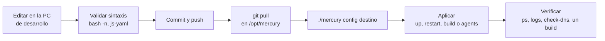
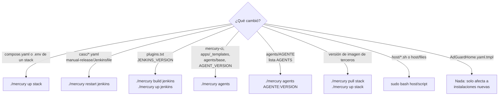

# 13. Mantenimiento y extensión

Cómo validar un cambio, qué reconstruir después, cómo añadir piezas nuevas y qué trampas tiene el entorno.

## Flujo de trabajo



En la máquina de desarrollo no hay Docker. Lo que se puede comprobar ahí es la sintaxis; el comportamiento solo se verifica en el servidor. **Lo que no se ha ejecutado en el servidor se declara como no verificado**, en el commit y en la documentación.

## Validar un cambio

En la máquina de desarrollo:

```bash
bash -n mercury pipelines/lib/mercury-ci host/*.sh        # sintaxis de scripts
npx --yes js-yaml stacks/<grupo>/<stack>/compose.yaml     # sintaxis YAML (un archivo)
```

`js-yaml` comprueba que el YAML se puede leer, pero su línea de comandos no aplica las claves de fusión (`<<:`). En `casc/jenkins.yaml`, que las usa en todas las plantillas de agente, la salida no muestra el resultado ya combinado: hay que revisarlo a mano.

En el servidor:

```bash
./mercury list               # grupos y stacks, y cuáles tienen .env
./mercury config <destino>   # compose resuelto: variables sin definir y redes inválidas
./mercury up <destino>
./mercury ps <destino>
./mercury logs <stack> [servicio]
./mercury check-dns [nombre] # cadena AdGuard → servidor → contenedores → HTTPS
```

## Qué ejecutar después de cada cambio



| Cambio en | Comando | Motivo |
|---|---|---|
| `compose.yaml` o `.env` de un stack | `./mercury up <stack>` | Compose recrea lo que cambió |
| `stacks/devops/jenkins/casc/*.yaml` | `./mercury restart jenkins` | El YAML va montado: `up` no recrea el contenedor si no cambió el compose ni un `.env` |
| `pipelines/manual-release/Jenkinsfile` | `./mercury restart jenkins` | job-dsl lo lee al cargar la configuración |
| `stacks/devops/jenkins/.env`, `credentials.env` | `./mercury up jenkins` | Las variables de entorno exigen recrear el contenedor |
| `stacks/devops/jenkins/plugins.txt`, `JENKINS_VERSION` | `./mercury build jenkins && ./mercury up jenkins` | Los plugins van dentro de la imagen |
| `pipelines/lib/mercury-ci`, `apps/_templates/**`, `agents/base`, `AGENT_VERSION` | `./mercury agents` | Van copiados en la imagen base; los agentes publicados heredan de ella |
| `stacks/devops/jenkins/agents/<agente>`, lista `AGENTS` | `./mercury agents <agente>[:<versión>]`, y `./mercury restart jenkins` si hay plantilla nueva | Solo se reconstruye lo afectado |
| Versión de una imagen de terceros | `./mercury pull <stack> && ./mercury up <stack>` | |
| Configuración de Prometheus, Loki, Alloy o Grafana (`provisioning/`) | `./mercury restart <stack>` | Archivos montados |
| `dashboards/*.json` de Grafana | Nada | Grafana los relee cada 60 segundos |
| `host/files/daemon.json` | `sudo bash host/03-docker.sh` | Regenera `/etc/docker/daemon.json`, lo valida y reinicia Docker |
| `mounts` del ancla `x-agent-base` (cachés de dependencias) | `./mercury agents` y `./mercury restart jenkins` | El directorio de destino debe existir en la imagen base con dueño `jenkins` |
| `host/*.sh` | `sudo bash host/<script>` | Son idempotentes |
| `stacks/core/dns/AdGuardHome.yaml.tmpl` | Nada | `dns-init` no sobrescribe una configuración existente |
| Un Jenkinsfile de `apps/_templates/` | `./mercury agents`, y copiarlo de nuevo a los repos de las apps | Cada app tiene su copia; no se actualiza sola |

Un error frecuente: editar `mercury-ci` o un `Dockerfile` de `apps/_templates/` y lanzar un build esperando ver el cambio. El agente sigue usando la copia que lleva dentro de su imagen hasta que se ejecute `./mercury agents`. La explicación completa, con cómo comprobar qué versión lleva un agente, está en [scripts/01-como-se-aplican-los-cambios.md](../scripts/01-como-se-aplican-los-cambios.md).

## Recetas

Para modificar los scripts en sí (añadir un comando a `mercury` o un paso a `mercury-ci`), ver [scripts/02-mercury.md](../scripts/02-mercury.md) y [scripts/03-mercury-ci.md](../scripts/03-mercury-ci.md).

### Añadir un stack

1. Crea `stacks/<grupo>/<nombre>/compose.yaml` y `.env.example`. El `name:` es el nombre corto y debe ser único entre todos los grupos.
2. En el compose: versión de imagen en variable, `restart: unless-stopped`, `mem_limit`, `no-new-privileges` si la imagen lo admite, sin `ports:` salvo protocolo no HTTP.
3. Redes: `net-tools` si tiene interfaz web; red propia `internal: true` para su base de datos. Ver [07-redes-y-dns.md](07-redes-y-dns.md#reglas-al-añadir-un-servicio).
4. Datos: bind-mount en `${DATA_DIR}/<nombre>` o `${HDD_DIR}/<nombre>`, y su línea `mk` en `host/02-disks.sh` con el UID de la imagen.
5. Añade `<grupo>/<nombre>` a la lista `STACKS` de `mercury`, en la posición en que deba arrancar.
6. Suma su `mem_limit` a las tablas de `README.md` y de [06-arquitectura.md](06-arquitectura.md#presupuesto-de-memoria).
7. Si tiene base de datos, añade su volcado a `host/backup.sh`.
8. En el servidor: `sudo bash host/02-disks.sh`, copiar el `.env`, `./mercury config <nombre>`, `./mercury up <nombre>`, y crear su Proxy Host en NPM.

Si expone métricas, añade un `job_name` a `prometheus.yml` y conecta el servicio a una red que Prometheus comparta (`net-tools` o `net-obs`).

### Añadir una versión a un agente existente

Ejemplo: .NET 11.

1. `mercury`: añade `dotnet:11.0` a `AGENTS`.
2. `casc/jenkins.yaml`: copia una plantilla de `dotnet` y cambia `name`, `labelString` e `image`.
3. `casc/jenkins.yaml`: añade `11.0` al `choiceParam` `RUNTIME_VERSION` de `manual-release`, y actualiza el texto de la carpeta `dotnet` en el mapa `carpetas`.
4. Actualiza las tablas de versiones de [03-despliegues.md](../instalacion/03-despliegues.md#versiones-de-los-agentes) y [08-jenkins-y-agentes.md](08-jenkins-y-agentes.md#catálogo-y-etiquetas), y el comentario de `apps/_templates/dotnet/Jenkinsfile`.
5. En el servidor: `./mercury restart jenkins` y `./mercury agents dotnet:11.0`.

La versión debe existir como etiqueta tanto en la imagen de origen del agente (`dotnet/sdk`, `maven`, `node`, `python`) como en la de ejecución de la app (`aspnet`, `eclipse-temurin`, `node`, `python`).

Para que pase a ser la de por defecto, además: `AGENT_DEFAULT` en `mercury`; mover la etiqueta sin versión a su plantilla en `casc/jenkins.yaml`; y el valor por defecto del `ARG` en `apps/_templates/dotnet/Dockerfile`, en `agents/dotnet/Dockerfile` y en `compose.quick.yaml`.

### Añadir un agente para un lenguaje nuevo

Ejemplo: Go.

1. `stacks/devops/jenkins/agents/go/Dockerfile`, siguiendo el patrón de los existentes:
   - `ARG BASE` y `ARG VERSION=<por defecto>`.
   - Una etapa `FROM <imagen oficial>:${VERSION}` de la que copiar las herramientas.
   - `FROM ${BASE}`, `USER root` para instalar, y terminar con `USER jenkins`.
   - `ENV RUNTIME_VERSION=${VERSION}`.
   - No sobrescribir `/opt/java/openjdk`: es el Java con el que arranca el agente.
   - Si el lenguaje tiene una caché de dependencias, añade su volumen `mercury-cache-<herramienta>` a `mounts` en el ancla `x-agent-base` y crea el directorio de destino, con dueño `jenkins`, en el Dockerfile de la base.
2. `mercury`: entradas `go:<versión>` en `AGENTS` y `[go]=<versión>` en `AGENT_DEFAULT`.
3. `casc/jenkins.yaml`: una plantilla por versión, con `<<: *agent` y `<<: *agent-base`; la de por defecto lleva además la etiqueta `go`. Elige `memoryLimit` contando con el presupuesto de RAM.
4. `casc/jenkins.yaml`: una carpeta en el mapa `carpetas`.
5. Si las apps de ese lenguaje necesitan un empaquetado propio, añade también el runtime (receta siguiente).
6. En el servidor: `./mercury restart jenkins` y `./mercury agents go`.

### Añadir un runtime de empaquetado

1. `apps/_templates/<runtime>/Dockerfile`: empaqueta un compilado ya hecho, escucha en 8080 y termina con un usuario sin privilegios. Si admite versiones, declara un `ARG <LENGUAJE>_VERSION` con valor por defecto.
2. `apps/_templates/<runtime>/Dockerfile.dockerignore`, si el contexto es el código fuente.
3. `apps/_templates/<runtime>/Jenkinsfile`, copiando la estructura de una plantilla existente.
4. `pipelines/lib/mercury-ci`: si admite versiones, añade el runtime al `case` que traduce `RUNTIME_VERSION` a su `ARG`.
5. `casc/jenkins.yaml`: añade el runtime al `choiceParam` `RUNTIME` de `manual-release`.
6. Opcional, modo rápido: `apps/_templates/<runtime>/compose.quick.yaml` y el runtime en la lista `RUNTIMES` de `mercury` (y en su texto de ayuda).
7. Documenta el requisito de la app en [03-despliegues.md](../instalacion/03-despliegues.md#requisitos-de-una-app) y la fila del runtime en [09-pipelines-y-despliegue.md](09-pipelines-y-despliegue.md#plantillas-de-runtime).
8. En el servidor: `./mercury agents` y `./mercury restart jenkins`.

### Otras

| Tarea | Dónde |
|---|---|
| Añadir una carpeta de Jenkins | Mapa `carpetas` de `casc/jenkins.yaml`; `./mercury restart jenkins` |
| Añadir una cuenta de git | [03-despliegues.md](../instalacion/03-despliegues.md#credenciales-de-git) |
| Añadir una red compartida | `host/04-networks.sh`, y declararla `external` en cada compose |
| Abrir un puerto no HTTP | `ports:` ligado a `LAN_IP` en el compose y regla UFW limitada a `LAN_SUBNET` en `host/01-base.sh` |
| Añadir una alerta | `stacks/monitoring/metrics/prometheus/rules/mercury.yml`; `./mercury restart metrics` |
| Añadir un dashboard | JSON en `stacks/monitoring/grafana/dashboards/`, con las fuentes de datos por uid (`prometheus`, `loki`) |
| Cambiar la versión de un escáner | Constantes `TRIVY_IMAGE`, `SEMGREP_IMAGE`, `SONAR_SCANNER_IMAGE` de `mercury-ci`; `./mercury agents` |
| Actualizar un servicio | Versión en su `.env` y en su `.env.example`; `./mercury pull` y `up`. De uno en uno, leyendo las notas de versión |

## Mover o renombrar un stack

Git mueve los archivos versionados, pero **no los `.env`**, que están ignorados y se quedan en la carpeta antigua del servidor. Un cambio de ruta debe ir acompañado de un script de migración que los mueva. El precedente es `host/migrate-layout.sh`.

Mientras el `name:` del compose no cambie, el proyecto sigue siendo el mismo y los contenedores no se recrean. Si cambia la ruta de un bind-mount relativo (como `./casc` en Jenkins), el contenedor sí se recrea en el siguiente `up`.

## Trampas del entorno

| Trampa | Consecuencia | Qué hacer |
|---|---|---|
| Finales de línea CRLF | Un script con CRLF falla en Linux con errores confusos (`$'\r': command not found`) | `.gitattributes` fuerza LF. No lo desactives ni conviertas archivos a mano |
| El bit de ejecución no se conserva desde Windows | Un script nuevo llega al servidor sin permiso de ejecución | Invócalo y documéntalo como `bash host/<script>`. Systemd y `mercury backup` ya lo hacen así |
| `$` en `command:` de un compose | Compose intenta sustituirlo como variable | Escribe `$$` para un `$` literal |
| `${VAR}` en `casc/jenkins.yaml` | JCasC lo sustituye, también dentro del Groovy de `jobs:` | No uses `${...}` para variables de Groovy en esos scripts |
| `./mercury restart` no relee `.env` | El cambio de una variable no se aplica | Usa `./mercury up` |
| `./mercury up jenkins` tras editar solo `casc/` | No recrea el contenedor: el cambio no se aplica | Usa `./mercury restart jenkins` |
| `-v <ruta>` en un `docker run` desde un agente | Monta la ruta del host, no la del agente | Usa `--volumes-from`, como `mercury-ci` |
| Levantar un stack antes de `02-disks.sh` | Docker crea el directorio de datos como root y el servicio no puede escribir | `sudo chown -R <uid>:<gid> <ruta>`; los UID están en el script |
| Cambios desde la interfaz de Jenkins | Se pierden al reiniciar | Llévalos a `casc/` |
| Cambios desde el panel de AdGuard o de NPM | Persisten, pero no están en el repo | Anótalos: solo los cubre el backup |
| Valores reales en un `.env.example` | Quedan publicados en git | Revisa los `.env.example` antes de cada commit |

## Estado de verificación

En el servidor ya funcionan `edge`, `registry` y `jenkins`. Lo siguiente está escrito pero **no se ha ejecutado en el servidor**; al tocarlo o al ponerlo en marcha por primera vez, hay que comprobarlo y actualizar esta lista:

- Los permisos de `socket-proxy` para builds (`BUILD`, `SESSION`, `GRPC`).
- La plantilla propia de HAProxy en `socket-proxy` (`timeout http-keep-alive 1h`) y `errorDuration` en la nube Docker.
- El arranque de AdGuard desde `AdGuardHome.yaml.tmpl` y `host/06-dns.sh`.
- Las credenciales por dominio de Jenkins (`casc/credentials.yaml` con `credentials.env`).
- Las carpetas de Jenkins creadas por job-dsl.
- El runtime `spa`.
- Los agentes versionados: las anclas `x-` y `<<:` en `casc/jenkins.yaml`, el `javaExe` del agente, `RUNTIME_VERSION` en `mercury-ci package`.
- El plugin `lockable-resources` en `manual-release`.
- `disableConcurrentBuilds(abortPrevious: true)` en las plantillas Jenkinsfile.
- Las cachés de dependencias: la sintaxis `type=volume` en `mounts` del plugin Docker, el dueño de los volúmenes `mercury-cache-*` en su primer uso y `MAVEN_ARGS` con el bloqueo por archivo en builds simultáneos.
- El stage `Análisis` con `parallel` y `failFast`, los `timeout` por stage y `archiveArtifacts` de `semgrep.json` en las plantillas Jenkinsfile.
- `dotnet publish --no-build` y las cachés `RUN --mount=type=cache` de los Dockerfile de `flask` y `node`.
- El marcador de Trivy (`--skip-db-update` en `trivy-image`).
- `trivy-fs` con la caché de Maven montada en solo lectura y `--offline-scan`.
- `./mercury prune` contra un Docker real, `host/07-cleanup.sh`, el bloque `builder.gc` de `daemon.json` y la validación con `dockerd --validate` en `install_daemon_json`.

La lista se mantiene también en `CLAUDE.md`, en la raíz del repo.

## Diagnóstico

Por dónde empezar según el síntoma. Cada documento enlazado tiene el detalle.

| Síntoma | Primer paso | Detalle |
|---|---|---|
| Un nombre `*.int.<dominio>` no resuelve o no responde | `./mercury check-dns <nombre>` | [07](07-redes-y-dns.md#diagnóstico), [02](../instalacion/02-puesta-en-marcha.md#si-el-nombre-no-resuelve) |
| `docker login` falla | Tabla de errores de la fase 2 | [02](../instalacion/02-puesta-en-marcha.md#fase-2-registry) |
| Build en *Waiting for next available executor* | `./mercury agents list`; revisar la etiqueta del Jenkinsfile y `JENKINS_MAX_AGENTS` | [08](08-jenkins-y-agentes.md#ciclo-de-vida-de-un-agente) |
| Build 6 a 8 minutos en *Waiting for next available executor* sin nada más en marcha; en `./mercury logs jenkins`, `Exception while provisioning` o `Failed to stop container` con `Broken pipe` | Conexiones caducadas entre el plugin Docker y `socket-proxy`: comprobar que está montada `socket-proxy/haproxy.cfg.template` y que la nube tiene `errorDuration` | [08](08-jenkins-y-agentes.md#conexiones-entre-jenkins-y-socket-proxy) |
| El agente no llega a conectar | `./mercury logs jenkins` y `./mercury logs jenkins socket-proxy` | [02](../instalacion/02-puesta-en-marcha.md#fase-3-jenkins) |
| Jenkins no arranca tras editar `casc/` | `./mercury logs jenkins`: JCasC indica la clave que no entiende | [08](08-jenkins-y-agentes.md#configuración-como-código) |
| *Quality gate* falla al instante con `Unable to guess SonarQube task id` y antes aparece `Unable to locate 'report-task.txt' in the workspace` | El escáner escribió su carpeta de trabajo fuera del *workspace*. `mercury-ci sonar` la fija con `sonar.working.directory`; si el agente es anterior a ese cambio, `./mercury agents` | [09](09-pipelines-y-despliegue.md#comunicación-con-sonarqube) |
| `No plugin found for prefix 'sonar'` en un proyecto Maven, seguido de `Unable to locate 'report-task.txt'` | El Jenkinsfile usa el atajo `mvn sonar:sonar`: sustituirlo por las coordenadas completas de `apps/_templates/spring/Jenkinsfile` | [09](09-pipelines-y-despliegue.md#comunicación-con-sonarqube) |
| `trivy-fs` falla con `remote Maven repository returned 429 Too Many Requests` | El agente es anterior al cambio que da a Trivy la caché de Maven: `./mercury agents`. Maven Central bloquea la IP unos 30 minutos (`Retry-After`); hasta entonces también puede fallar `mvn` si necesita descargar algo | [09](09-pipelines-y-despliegue.md#por-qué-los-escáneres-son-contenedores-hermanos) |
| *Quality gate* agota los 10 minutos | Falta el webhook de SonarQube hacia Jenkins | [09](09-pipelines-y-despliegue.md#comunicación-con-sonarqube) |
| SonarQube no arranca | `sysctl vm.max_map_count` debe dar 524288 | [01](../instalacion/01-host.md) |
| *Deploy* falla a los 120 segundos | `docker logs <app>-<env>`; revisar `APPS_DIR/<env>/<app>.env` | [09](09-pipelines-y-despliegue.md#despliegue) |
| Un cambio en `mercury-ci` no tiene efecto | Falta `./mercury agents` (con solo `agents <agente>` la base no se reconstruye) | [scripts/01](../scripts/01-como-se-aplican-los-cambios.md) |
| Un servicio no puede escribir en su directorio | Dueño incorrecto del bind-mount | [06](06-arquitectura.md#datos-fuera-del-repo) |
| `variable is not set` al hacer `config` o `up` | Falta la variable en el `.env` del stack; compárala con su `.env.example` | [12](12-referencia.md#variables) |
| El servidor va lento o un contenedor se reinicia | Grafana > *Mercury - Resumen*; alertas `MemoriaCasiAgotada` y `ContenedorCercaDelLimite` | [11](11-observabilidad-y-backups.md#alertas) |
| El HDD se llena | Limpieza del registry; retención de Prometheus y Loki | [10](10-registry-e-imagenes.md#limpieza) |
| El SSD se llena | `./mercury prune`; si no basta, `--caches` y `--all` | [10](10-registry-e-imagenes.md#limpieza-del-host) |
| Un build falla al restaurar dependencias con errores de paquete corrupto o de permisos en `~/.nuget`, `~/.m2`, `~/.npm` | Caché dañada o con dueño incorrecto: `./mercury prune --caches` | [08](08-jenkins-y-agentes.md#cachés-de-dependencias) |
| `dotnet publish` falla en *Imagen* tras compilar bien | `PROJECT` no forma parte de `SOLUTION` (`--no-build`) | [09](09-pipelines-y-despliegue.md#qué-hace-que-un-build-sea-rápido) |
| Un build se aborta a los 45 minutos | `timeout` del stage *CI*; súbelo en el Jenkinsfile de esa app | [09](09-pipelines-y-despliegue.md#límites-de-tiempo-e-informes) |

## Mantener esta documentación

- Tres carpetas: `instalacion/` (guías paso a paso), `arquitectura/` (cómo está construido) y `scripts/` (interior de `mercury` y `mercury-ci`). El índice es `docs/README.md`.
- Idioma: español, también en comentarios y mensajes de commit.
- Un cambio en una convención, una lista (`STACKS`, `AGENTS`, `RUNTIMES`), un puerto, una red o un límite de memoria se refleja en el documento que lo describe, en el mismo commit.
- Las tablas de versiones de [05](05-requisitos-y-conceptos.md#herramientas-que-componen-la-plataforma) repiten los `.env.example`: actualízalas al subir una versión.
- Los diagramas son Mermaid dentro de bloques de código. Mantén las etiquetas de los nodos entre comillas y sin `<`, `>` ni `${}`, que algunos visores interpretan.
- `CLAUDE.md` resume la arquitectura para el asistente de código: si cambia una regla de fondo, actualízalo también.
