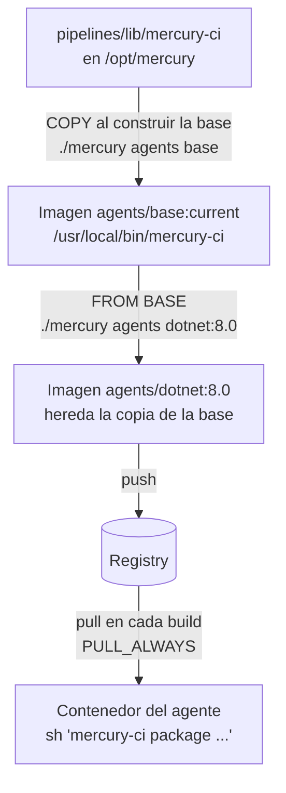
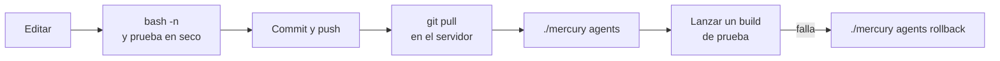

# 1. Dónde corre cada script y cuándo se aplica un cambio

Lo primero que hay que saber antes de modificar un script: **no todos se ejecutan desde el repo**. Algunos se ejecutan desde una copia, y editar el original no cambia nada hasta que esa copia se regenera.

## El caso que más tiempo hace perder

Se edita `pipelines/lib/mercury-ci`, se hace `git pull` en el servidor, se lanza un pipeline y el cambio no aparece. El motivo: el pipeline no ejecuta el archivo del repo, sino la copia que quedó dentro de la imagen del agente el día que se construyó.



Tres hechos explican todo el comportamiento:

1. **La copia se hace al construir la imagen base.** `stacks/devops/jenkins/agents/base/Dockerfile` contiene `COPY pipelines/lib/mercury-ci /usr/local/bin/mercury-ci` y `COPY apps/_templates /opt/mercury/templates`.
2. **Los agentes de lenguaje heredan de la base** (`FROM ${BASE}`). Llevan la copia que tenía la base en el momento en que se construyeron ellos.
3. **El agente no ve el repo.** Solo tiene montados `INBOX_DIR` y `APPS_DIR`. Cuando un Jenkinsfile ejecuta `mercury-ci`, resuelve a `/usr/local/bin/mercury-ci` dentro del contenedor.

Tras reconstruir no hace falta reiniciar Jenkins: las plantillas de agente usan `pullStrategy: PULL_ALWAYS`, así que el siguiente build descarga la imagen nueva.

### El comando correcto

```bash
./mercury agents
```

Sin argumentos, reconstruye la base y todos los agentes ya publicados.

**Trampa:** `./mercury agents dotnet:8.0` por sí solo **no** aplica un cambio de `mercury-ci`. Si la base ya existe, en local o en el registry, se reutiliza tal cual y el agente vuelve a heredar el script antiguo. Para reconstruir solo un agente con el script nuevo, hay que nombrar la base:

```bash
./mercury agents base dotnet:8.0
```

Los demás agentes publicados seguirán con la copia antigua hasta que se reconstruyan.

## Tabla de propagación

| Archivo | Dónde se ejecuta | Cómo llega ahí | Un cambio se aplica con |
|---|---|---|---|
| `mercury` | Host | Se ejecuta directamente desde `/opt/mercury` | `git pull`. Inmediato |
| `host/*.sh` | Host, con `sudo` | Se ejecutan directamente | `git pull` y volver a ejecutar el script |
| `host/backup.sh` | Host, lo llama un timer de systemd por su ruta | Se ejecuta directamente | `git pull`. La siguiente copia ya usa la versión nueva |
| `pipelines/lib/mercury-ci` | Dentro de cada agente | **Copiado** en la imagen base | `./mercury agents` |
| `apps/_templates/<runtime>/Dockerfile` | Lo lee `mercury-ci package` dentro del agente | **Copiado** en la imagen base (`/opt/mercury/templates`) | `./mercury agents` |
| `apps/_templates/compose.deploy.yaml`, usado por un pipeline | Dentro del agente | **Copiado** en la imagen base | `./mercury agents` |
| `apps/_templates/compose.deploy.yaml`, usado por `./mercury deploy` | Host | Se lee directamente del repo | `git pull`. Inmediato |
| `apps/_templates/<runtime>/compose.quick.yaml` | Host (`./mercury quick`) | Se lee directamente del repo | `git pull`. Inmediato |
| `apps/_templates/<runtime>/Jenkinsfile*` | Jenkins, desde el repo de cada app | **Copiado a mano** al repo de la app | Copiarlo de nuevo a cada repo |
| `pipelines/manual-release/Jenkinsfile` | Controller de Jenkins | Carpeta `pipelines/` montada; job-dsl lo lee al cargar la configuración | `./mercury restart jenkins` |
| `stacks/devops/jenkins/agents/<agente>/Dockerfile` | Al construir ese agente | — | `./mercury agents <agente>:<versión>` |
| `stacks/devops/jenkins/casc/*.yaml` | Controller de Jenkins | Carpeta montada | `./mercury restart jenkins` |

Consecuencia que conviene tener presente: `compose.deploy.yaml` existe en dos sitios a la vez. Tras editarlo, `./mercury deploy` (host) usa ya la versión nueva, mientras que los pipelines siguen con la antigua hasta `./mercury agents`. Durante ese intervalo un mismo despliegue da resultados distintos según por dónde se lance.

## Comprobar qué versión lleva un agente

Antes de dar por roto un cambio, comprueba que el agente lo tiene.

**Commit con el que se construyó una imagen.** Cada imagen de agente lleva una etiqueta con el commit del repo:

```bash
docker pull registry.int.<dominio>/agents/dotnet:8.0
docker inspect --format '{{ index .Config.Labels "org.opencontainers.image.revision" }}' \
  registry.int.<dominio>/agents/dotnet:8.0
git -C /opt/mercury rev-parse --short HEAD        # debe coincidir tras ./mercury agents
```

Un sufijo `-dirty` indica que se construyó con cambios sin confirmar: el contenido no corresponde exactamente a ningún commit.

**Comparar el script de la imagen con el del repo:**

```bash
docker run --rm --pull always --entrypoint cat registry.int.<dominio>/agents/dotnet:8.0 \
  /usr/local/bin/mercury-ci | diff - /opt/mercury/pipelines/lib/mercury-ci && echo "idénticos"
```

**Desde un pipeline**, como paso temporal de diagnóstico:

```groovy
sh 'sha256sum "$(command -v mercury-ci)"'
```

y en el servidor `sha256sum /opt/mercury/pipelines/lib/mercury-ci`.

## Ciclo recomendado para cambiar `mercury-ci`



1. Edita y valida la sintaxis: `bash -n pipelines/lib/mercury-ci`.
2. Prueba en seco en tu PC (ver [03-mercury-ci.md](03-mercury-ci.md#probar-sin-docker)).
3. **Haz commit antes de reconstruir.** La etiqueta fija de la imagen sale del commit; sin él queda como `-dirty` y no se puede saber qué contiene.
4. En el servidor: `git pull` y `./mercury agents`.
5. Lanza un build y comprueba el resultado.
6. Si rompe los builds, vuelve a la imagen anterior sin tocar el código:

   ```bash
   ./mercury agents rollback dotnet:8.0 <commit anterior>
   ./mercury agents rollback base <commit anterior>
   ```

   Hay que revertir cada agente afectado. Los commits disponibles se ven en la interfaz del registry.

Reconstruir todos los agentes publicados tarda varios minutos. Para iterar sobre un cambio, reconstruye solo la base y un agente (`./mercury agents base dotnet:8.0`), prueba con un job de ese lenguaje y, cuando funcione, ejecuta `./mercury agents` para el resto.

## Por qué está diseñado así

Montar el repo en los agentes haría que los cambios fueran inmediatos, pero a cambio:

- El agente dependería de una ruta del host y dejaría de ser autosuficiente.
- No habría vuelta atrás: un error en `mercury-ci` rompería todos los pipelines en el acto, sin una imagen anterior a la que volver.
- No se sabría con qué versión del script se construyó cada app.

Con la copia dentro de la imagen, cada construcción queda identificada por un commit y se puede revertir. El precio es el paso de reconstrucción.
