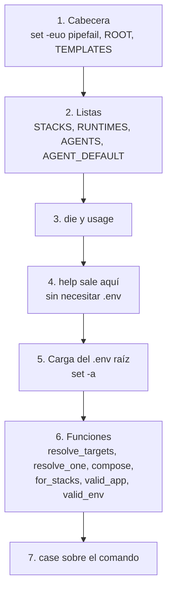
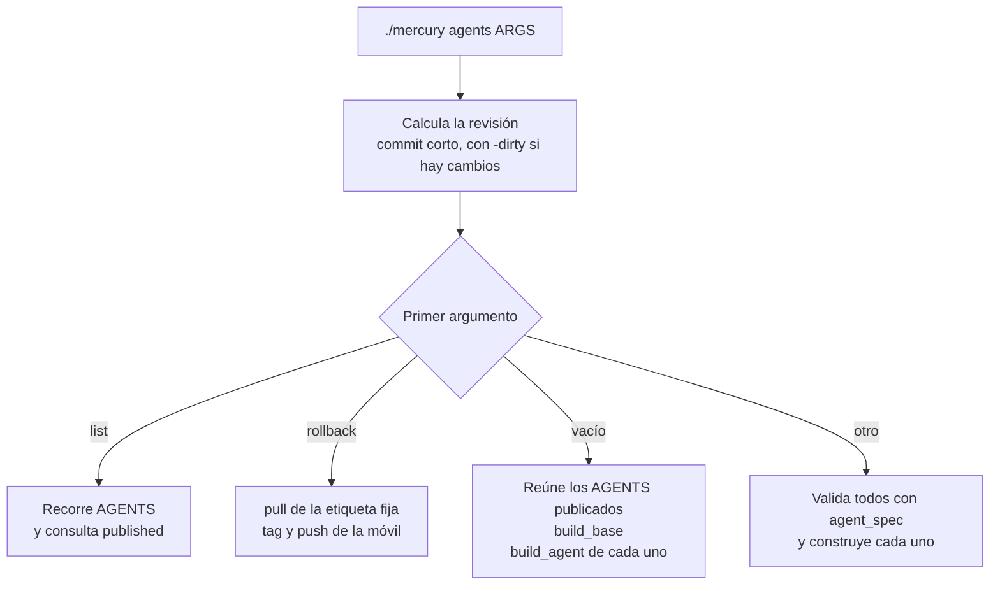

# 2. El script `mercury`

Cómo está escrito el operador de los stacks y cómo añadirle cosas. La lista de comandos y su uso está en [12-referencia.md](../arquitectura/12-referencia.md#mercury); aquí se explica el interior.

| | |
|---|---|
| Archivo | `mercury`, en la raíz del repo |
| Se ejecuta en | El host, desde cualquier directorio |
| Un cambio se aplica con | `git pull`. Es inmediato: no hay copia |
| Depende de | `docker` con compose y buildx, `git`, `sudo`, `htpasswd`, `curl`, `getent`, `awk` |

## Estructura del archivo

El script se lee de arriba abajo en este orden:



### Cabecera

```bash
set -euo pipefail
ROOT="$(cd "$(dirname "$(readlink -f "${BASH_SOURCE[0]}")")" && pwd)"
```

- `set -e`: el script termina en el primer comando que falla. `-u`: usar una variable sin definir es un error. `-o pipefail`: una tubería falla si falla cualquiera de sus partes.
- `ROOT` es la carpeta del script, resuelta con `readlink -f` para que funcione también a través de un enlace simbólico. Todas las rutas se construyen a partir de `ROOT`, nunca del directorio actual.

### Listas: la fuente de verdad

| Lista | Contenido | La usan |
|---|---|---|
| `STACKS` | `<grupo>/<stack>`, en orden de arranque | Todos los comandos de stacks, `list` |
| `RUNTIMES` | Runtimes con `compose.quick.yaml` | `quick` |
| `AGENTS` | Catálogo `<agente>:<versión>` | `agents` |
| `AGENT_DEFAULT` | Mapa agente → versión por defecto | `agents` |

Un stack que no está en `STACKS` no existe para `mercury`, aunque su carpeta esté en el repo.

### Carga de la configuración

```bash
[[ -f "$ROOT/.env" ]] || die "falta $ROOT/.env (copia .env.example y ajústalo)"
set -a; . "$ROOT/.env"; set +a
```

`set -a` hace que todas las variables definidas mientras está activo se **exporten**. Así las ven también los procesos hijos: por eso `./mercury deploy` puede invocar `docker compose` sin `--env-file` y aun así `compose.deploy.yaml` recibe `APPS_DIR`.

Algunos comandos cargan además el `.env` de un stack, de la misma forma: `dns-init` (el de `dns`) y `agents` (el de `jenkins`, para `AGENT_VERSION`).

`help` se resuelve antes de esta carga: funciona en una máquina sin `.env`.

### Funciones compartidas

| Función | Recibe | Hace |
|---|---|---|
| `die <mensaje>` | Texto | Escribe `error: ...` en la salida de error y termina con código 1 |
| `usage` | — | Imprime la ayuda |
| `resolve_targets <destino>` | `all`, un grupo, un stack o `grupo/stack` | Imprime las entradas de `STACKS` que coinciden, una por línea. Falla si no hay ninguna |
| `resolve_one <destino>` | Ídem | Como la anterior, pero falla si el destino es un grupo |
| `compose <grupo/stack> <args...>` | Una entrada de `STACKS` | Comprueba que existe el `.env` del stack (y `credentials.env` en Jenkins) y ejecuta `docker compose` con los dos `--env-file` |
| `for_stacks <destino> <args...>` | Un destino | Llama a `compose` para cada stack. Con varios, omite los que no tienen `.env` en lugar de abortar |
| `valid_app <nombre>` | Nombre de app | Lo valida contra `^[a-z0-9]([a-z0-9-]{0,40}[a-z0-9])?$` |
| `valid_env <env>` | Ambiente | Acepta solo `dev` o `prod` |

Cómo resuelve `resolve_targets` un destino. Compara el argumento con cada entrada de `STACKS` de cuatro formas:

| Argumento | Expresión | Coincide con |
|---|---|---|
| `all` | `"$target" == all` | Todas |
| `devops/jenkins` | `"$s" == "$target"` | Esa entrada |
| `devops` | `"${s%%/*}" == "$target"` (lo anterior a la `/`) | Todas las del grupo |
| `jenkins` | `"${s##*/}" == "$target"` (lo posterior a la `/`) | Esa entrada |

De ahí la regla de que el nombre corto de un stack sea único entre grupos, y de que ningún stack se llame igual que un grupo.

### El `case` de comandos

Cada comando es una rama del `case "$cmd"`. Hay tres formas, según a qué se aplica:

```bash
# Acepta stack, grupo o all
up)      [[ $# -ge 1 ]] || die "uso: mercury up <destino>";      for_stacks "$1" up -d ;;

# Exige un único stack
build)
  [[ $# -ge 1 ]] || die "uso: mercury build <stack>"
  stack="$(resolve_one "$1")"
  compose "$stack" build --pull
  ;;

# No opera sobre un stack
registry-gc)
  docker exec registry registry garbage-collect --delete-untagged /etc/distribution/config.yml
  ;;
```

La rama `*)` del final muestra la ayuda y termina con error ante un comando desconocido.

## El comando `agents` por dentro

Es la rama más larga y define sus propias funciones, que solo existen mientras se ejecuta:

| Función | Hace |
|---|---|
| `agent_spec <arg>` | Normaliza `dotnet` o `dotnet:8.0` a una entrada del catálogo. Falla si el agente no existe o la versión no está en `AGENTS` |
| `published <imagen>` | `docker manifest inspect`: verdadero si la imagen está en el registry |
| `build_base` | Construye y publica `base:current` y `base:<revisión>`, con la raíz del repo como contexto |
| `ensure_base` | Construye la base solo si no existe ni en local ni en el registry, y como mucho una vez por ejecución |
| `build_agent <agente>:<versión>` | Llama a `ensure_base`, y construye y publica `<agente>:<versión>` y `<agente>:<versión>-<revisión>` |



Tres detalles con consecuencias:

- **`ensure_base` no reconstruye una base existente.** Es lo que hace que `./mercury agents dotnet:8.0` no aplique un cambio de `mercury-ci`. Ver [01-como-se-aplican-los-cambios.md](01-como-se-aplican-los-cambios.md#el-comando-correcto).
- **Sin argumentos, la lista de agentes publicados se calcula antes de construir la base**, y después se reconstruyen la base y cada uno de ellos, en ese orden.
- **Con argumentos, todos se validan antes de construir nada.** Un nombre mal escrito en el tercer argumento no deja el trabajo a medias.

`published` necesita una sesión iniciada en el registry desde el host (`docker login`). Sin ella, `agents list` muestra todo como no publicado y `./mercury agents` sin argumentos no reconstruye ningún agente.

## Añadir cosas

### Un stack

Añade `<grupo>/<nombre>` a `STACKS`, en la posición en que deba arrancar. No hace falta nada más en el script: `list`, `up`, `down` y el resto lo recogen. La receta completa está en [13-mantenimiento-y-extension.md](../arquitectura/13-mantenimiento-y-extension.md#añadir-un-stack).

### Una versión de agente o un agente nuevo

Añade la entrada a `AGENTS` y, si es un agente nuevo, su versión por defecto a `AGENT_DEFAULT`. El script no necesita más cambios, pero sí `casc/jenkins.yaml`: ver [13-mantenimiento-y-extension.md](../arquitectura/13-mantenimiento-y-extension.md#añadir-una-versión-a-un-agente-existente).

### Un runtime con modo rápido

Añádelo a `RUNTIMES` y a la línea `runtimes:` del texto de `usage`. Debe existir `apps/_templates/<runtime>/compose.quick.yaml`.

### Un comando nuevo

1. Añade una rama al `case`, antes de `*)`.
2. Valida los argumentos en la primera línea, con un mensaje `uso: mercury <comando> <args>`.
3. Usa `for_stacks`, `resolve_one` con `compose`, o comandos directos, según el tipo.
4. Añade su línea al texto de `usage`, en la sección que corresponda.
5. Documéntalo en [12-referencia.md](../arquitectura/12-referencia.md#mercury).

Ejemplo: un comando `top` que muestre el consumo de los contenedores de un stack.

```bash
  top)
    [[ $# -ge 1 ]] || die "uso: mercury top <stack>"
    stack="$(resolve_one "$1")"
    compose "$stack" top
    ;;
```

Ejemplo: un comando que acepta un grupo o `all`, en una sola línea.

```bash
  images)  [[ $# -ge 1 ]] || die "uso: mercury images <destino>";  for_stacks "$1" images ;;
```

## Convenciones del script

| Convención | Motivo |
|---|---|
| Validar todo antes de actuar | Un error de argumentos no debe dejar nada a medias |
| Errores con `die`, en español y con el remedio | `die "falta stacks/$stack/.env (copia ... y ajústalo)"` dice qué hacer |
| Rutas siempre desde `ROOT` | El script funciona desde cualquier directorio |
| Variables entre comillas: `"$1"`, `"${STACKS[@]}"` | Con `set -u` y nombres con espacios, sin comillas falla |
| `local` en todas las variables de función | No contaminar el resto del script |
| `sudo` solo en la línea que lo necesita | El script se ejecuta como el operador, no como root |
| Sin opciones interactivas salvo las propias de la herramienta (`htpasswd` pide contraseña) | Se puede usar desde otros scripts |

Trampas concretas de este archivo:

- **Las variables de una rama del `case` son globales**: `local` solo es válido dentro de una función. Usa nombres que no choquen con los de las listas (`STACKS`, `AGENTS`) ni con variables del `.env`.
- **Con `set -e`, un comando que puede fallar legítimamente necesita `|| true`** o ir dentro de un `if`. Por eso las consultas de `check-dns` terminan en `|| true`.
- **`[[ cond ]] && comando` como última línea de una función** devuelve 1 si la condición es falsa, y con `set -e` puede terminar el script. Usa `if` o añade `|| true`.
- **Lógica duplicada con `mercury-ci`**: la expresión regular de `valid_app` y el comando de `deploy` están en los dos scripts. Un cambio en uno hay que repetirlo en el otro.

## Probar sin Docker

En la máquina de desarrollo no hay Docker, pero se puede comprobar qué comandos lanzaría el script poniendo un `docker` falso delante en el `PATH`. Necesita un `.env`, así que conviene hacerlo en una copia del repo:

```bash
bash -n mercury                                  # 1. sintaxis

mkdir -p /tmp/fake                               # 2. docker falso que solo imprime
printf '#!/bin/sh\necho "[docker] $*"\n' > /tmp/fake/docker
chmod +x /tmp/fake/docker

cp -r . /tmp/mercury-prueba && cd /tmp/mercury-prueba
cp .env.example .env
cp stacks/devops/jenkins/.env.example stacks/devops/jenkins/.env
cp stacks/devops/jenkins/credentials.env.example stacks/devops/jenkins/credentials.env

PATH="/tmp/fake:$PATH" bash mercury list
PATH="/tmp/fake:$PATH" bash mercury up jenkins
PATH="/tmp/fake:$PATH" bash mercury agents dotnet:8.0
```

Salida de `up jenkins`: la línea exacta de `docker compose` con los dos `--env-file`. Salida de `agents dotnet:8.0`: el `docker build` con sus `--build-arg` y los dos `docker push`.

Límites de la prueba: el `docker` falso responde siempre con éxito, así que `published` y `ensure_base` creen que todo existe. Sirve para ver argumentos y validaciones, no el comportamiento real. La validación de verdad es en el servidor, con `./mercury config <destino>` antes de `up`.

En Git Bash sobre Windows, la carpeta del `docker` falso debe ir en el `PATH` con formato POSIX (`/c/Users/...`), no `C:/Users/...`.
