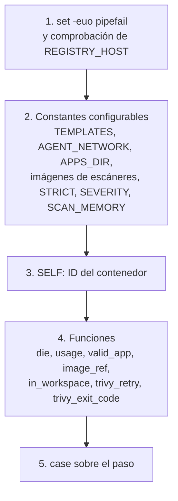

# 3. El script `mercury-ci`

Cómo están escritos los pasos de pipeline y cómo añadirles cosas. Qué hace cada paso desde el punto de vista de un pipeline está en [09-pipelines-y-despliegue.md](../arquitectura/09-pipelines-y-despliegue.md#mercury-ci); aquí se explica el interior.

| | |
|---|---|
| Archivo | `pipelines/lib/mercury-ci` |
| Se ejecuta en | Dentro de los agentes de Jenkins, como `/usr/local/bin/mercury-ci` |
| Un cambio se aplica con | `./mercury agents`. **No es inmediato**: ver [01-como-se-aplican-los-cambios.md](01-como-se-aplican-los-cambios.md) |
| Depende de | El cliente `docker` con compose y buildx, que lleva la imagen base |
| Lo invocan | Los Jenkinsfile de cada app y `pipelines/manual-release/Jenkinsfile` |

## El entorno en el que corre

El script asume cosas que solo son ciertas dentro de un agente:

| Supuesto | Quién lo garantiza |
|---|---|
| `REGISTRY_HOST` está definida | `environmentsString` del ancla `x-agent-base` en `casc/jenkins.yaml` |
| `DOCKER_HOST=tcp://socket-proxy:2375` | Ídem |
| `hostname` devuelve el ID del contenedor | Docker, por defecto |
| Las plantillas están en `/opt/mercury/templates` | `COPY` del Dockerfile de la base |
| `/inbox` y `/srv/mercury/apps` existen | `mounts` del ancla `x-agent-base` |
| El usuario es `jenkins` (UID 1000) | Imagen base |
| `REGISTRY_USR` y `REGISTRY_PSW` | `REGISTRY = credentials('registry')` en el Jenkinsfile |
| `SONAR_HOST_URL` y `SONAR_AUTH_TOKEN` | `withSonarQubeEnv('sonarqube')` en el Jenkinsfile |
| `RUNTIME_VERSION` | `ENV` de la imagen del agente, o parámetro de `manual-release` |

**No hay Docker dentro del agente.** Todo `docker ...` que ejecuta el script lo realiza el Docker del host. Es la regla que más condiciona cómo se escribe un paso:

| Quiero | No funciona | Se hace así |
|---|---|---|
| Que otro contenedor vea el código del build | `docker run -v "$PWD":/src` (monta la ruta del host) | `in_workspace <imagen> ...`, que usa `--volumes-from` |
| Que otro contenedor lea una imagen local | Montar el socket | `--network "$AGENT_NETWORK" -e DOCKER_HOST=...` |
| Construir una imagen desde una carpeta | — | `docker buildx build <carpeta>`: el contexto viaja por la API |

## Estructura del archivo



### Constantes

Todas siguen el patrón `NOMBRE="${VARIABLE_DE_ENTORNO:-valor por defecto}"`: un Jenkinsfile puede cambiar cualquiera desde su bloque `environment` sin tocar el script.

| Constante | Variable de entorno | Por defecto |
|---|---|---|
| `TEMPLATES` | `MERCURY_TEMPLATES` | `/opt/mercury/templates` |
| `AGENT_NETWORK` | `AGENT_NETWORK` | `mercury-jenkins` |
| `APPS_DIR` (exportada) | `APPS_DIR` | `/srv/mercury/apps` |
| `TRIVY_IMAGE` | `TRIVY_IMAGE` | `aquasec/trivy:0.75.0` |
| `SEMGREP_IMAGE` | `SEMGREP_IMAGE` | `semgrep/semgrep:1.178.0` |
| `SONAR_SCANNER_IMAGE` | `SONAR_SCANNER_IMAGE` | `sonarsource/sonar-scanner-cli:12.2` |
| `STRICT` | `MERCURY_SCAN_STRICT` | `0` |
| `SEVERITY` | `MERCURY_SCAN_SEVERITY` | `HIGH,CRITICAL` |
| `SCAN_MEMORY` | `MERCURY_SCAN_MEMORY` | `1536m` |

`APPS_DIR` se exporta porque no la usa el script, sino `compose.deploy.yaml`, que la recibe del entorno.

`MERCURY_TEMPLATES` existe sobre todo para poder probar el script fuera de un agente.

### Funciones

| Función | Hace |
|---|---|
| `die <mensaje>` | Escribe `mercury-ci: ...` en la salida de error y termina con código 1 |
| `usage` | Imprime la ayuda |
| `valid_app <nombre>` | Valida el nombre de app. Misma expresión regular que en `mercury` |
| `image_ref <app> <tag>` | Imprime `<REGISTRY_HOST>/apps/<app>:<tag>`. Único lugar donde se forma ese nombre |
| `in_workspace <args de docker run>` | `docker run --rm --memory "$SCAN_MEMORY" --volumes-from "$SELF" -w "$PWD" ...`: ejecuta una imagen sobre el *workspace* del agente, en el mismo directorio |
| `trivy_retry <comando...>` | Ejecuta el comando hasta 3 veces, con 20 segundos de espera. El código 10 no se reintenta: son hallazgos en modo estricto |
| `trivy_exit_code` | Imprime `10` en modo estricto y `0` si no |

`in_workspace` es la pieza central. `--volumes-from "$SELF"` da al contenedor nuevo los mismos volúmenes que el agente, y `-w "$PWD"` lo sitúa en el mismo directorio. Lo que el escáner escriba (por ejemplo `semgrep.json`) queda en el *workspace*.

`trivy_retry` existe porque todos los builds comparten el volumen `mercury-trivy-cache` con la base de datos de Trivy: si dos la actualizan a la vez, uno falla.

### El paso `package`, por partes

Es la rama más larga. Hace cuatro cosas en orden:

| Parte | Qué decide | Variables de entrada |
|---|---|---|
| 1. Validación | El nombre de app es válido y el directorio existe | Argumentos |
| 2. Elección del Dockerfile | Cuál de los cuatro candidatos se usa | `MERCURY_DOCKERFILE`, archivos presentes |
| 3. Versión del runtime | Qué `--build-arg` se pasa | `RUNTIME_VERSION`, runtime |
| 4. Construcción | `docker buildx build --pull --load` y `docker push` | Lo anterior |

El orden de la elección del Dockerfile y la tabla de `ARG` por runtime están en [09-pipelines-y-despliegue.md](../arquitectura/09-pipelines-y-despliegue.md#empaquetado). La traducción de versión es este `case`:

```bash
case "$runtime" in
  dotnet) version_arg=DOTNET_VERSION ;;
  spring) version_arg=JAVA_VERSION ;;
  node)   version_arg=NODE_VERSION ;;
  flask)  version_arg=PYTHON_VERSION ;;
  *)      version_arg="" ;;
esac
```

Un runtime que no aparece ahí ignora `RUNTIME_VERSION`.

Antes de construir, el paso escribe en el log el Dockerfile elegido y su origen, el contexto, la versión y la imagen. Es lo primero que hay que mirar cuando una imagen no sale como se esperaba.

## Los pasos son una interfaz pública

Cada app tiene en su repo una **copia** de un Jenkinsfile que llama a `mercury-ci` con unos nombres de paso y unos argumentos concretos. Esos repos no se actualizan al cambiar el script.

| Cambio | Efecto en los pipelines existentes |
|---|---|
| Añadir un paso nuevo | Ninguno |
| Añadir un argumento opcional al final | Ninguno |
| Añadir una variable de entorno con valor por defecto | Ninguno |
| Cambiar el valor por defecto de una variable | Cambia el comportamiento de todos en el siguiente build |
| Renombrar o eliminar un paso | **Rompe todos los que lo usan** |
| Cambiar el orden o el número de argumentos obligatorios | **Rompe todos los que lo usan** |

Regla práctica: lo nuevo se añade como paso nuevo o como variable opcional. Si hay que retirar un paso, se mantiene un tiempo aceptando la forma antigua.

## Añadir cosas

### Un paso nuevo

1. Añade una rama al `case "$step"`, antes de `*)`.
2. Valida el número de argumentos con `die "uso: ..."`.
3. Añade su línea a `usage`.
4. Documéntalo en [09-pipelines-y-despliegue.md](../arquitectura/09-pipelines-y-despliegue.md#mercury-ci) y en [12-referencia.md](../arquitectura/12-referencia.md#mercury-ci).
5. Si las plantillas deben usarlo, edita los Jenkinsfile de `apps/_templates/`.
6. `./mercury agents`.

### Un escáner nuevo

Ejemplo: Hadolint, para revisar el Dockerfile del proyecto.

Constante, junto a las demás, con la versión fijada:

```bash
HADOLINT_IMAGE="${HADOLINT_IMAGE:-hadolint/hadolint:<versión>}"
```

Rama del `case`:

```bash
  hadolint)
    [[ -f Dockerfile ]] || { echo "mercury-ci: no hay Dockerfile en el repo, nada que revisar"; exit 0; }
    args=()
    [[ "$STRICT" == 1 ]] || args+=(--no-fail)
    in_workspace "$HADOLINT_IMAGE" hadolint "${args[@]}" Dockerfile
    ;;
```

Lo que debe cumplir cualquier escáner:

| Requisito | Cómo |
|---|---|
| Versión de imagen fijada, nunca `latest` | Constante con valor por defecto |
| Límite de memoria | Usar `in_workspace`, que ya pone `--memory` |
| Ver el código | Usar `in_workspace`, no `-v` |
| Respetar el modo informativo | Con `STRICT=0`, los hallazgos no deben devolver un código distinto de 0 |
| No dejar contenedores | `--rm`, que `in_workspace` ya pone |
| Archivos con el dueño correcto | Si escribe en el *workspace*, ejecutarlo con `--user "$(id -u):$(id -g)"`, como Semgrep |

Contar su memoria: cada escáner puede usar hasta `SCAN_MEMORY` fuera del límite del agente.

### La traducción de versión de un runtime nuevo

Añade su línea al `case` de `package` con el nombre del `ARG` que declara su Dockerfile. La receta completa de un runtime está en [13-mantenimiento-y-extension.md](../arquitectura/13-mantenimiento-y-extension.md#añadir-un-runtime-de-empaquetado).

### Una variable de configuración

Sigue el patrón de las constantes: `NOMBRE="${MERCURY_ALGO:-valor}"`, con el prefijo `MERCURY_` para lo que se espera que ajuste un Jenkinsfile. Documéntala en [12-referencia.md](../arquitectura/12-referencia.md#variables-de-mercury-ci-y-de-los-jenkinsfile).

### Cambiar la versión de un escáner

Cambia el valor por defecto de su constante y ejecuta `./mercury agents`. Para probar una versión en una sola app antes, define la variable en el `environment` de su Jenkinsfile:

```groovy
environment {
  TRIVY_IMAGE = 'aquasec/trivy:<versión nueva>'
}
```

Así no hace falta reconstruir ningún agente.

## Convenciones del script

| Convención | Motivo |
|---|---|
| Variables obligatorias con `: "${VAR:?mensaje}"` | Falla al principio, con un mensaje que dice qué falta y de dónde debería venir |
| Todo valor configurable con `${VAR:-defecto}` | Un Jenkinsfile lo ajusta sin tocar el script |
| Mensajes con el prefijo `mercury-ci:` | En el log de Jenkins se distingue quién habla |
| Escribir en el log qué se va a hacer antes de hacerlo | El log es la única ventana al build |
| La contraseña del registry por `--password-stdin` | No aparece en la lista de procesos ni en el log |
| Sin `set -x` | Imprimiría credenciales |
| Arrays para argumentos opcionales: `args+=(--error)` | Evita errores de comillas |

Trampas concretas:

- **Un array vacío con `set -u`.** `"${build_args[@]}"` con el array vacío da error en Bash anterior a 4.4. La imagen base trae una versión posterior; tenlo en cuenta si pruebas el script en otra máquina.
- **`$?` tras un comando con `set -e`.** Para capturar un código de salida sin que el script termine: `code=0; comando || code=$?`, como hace `trivy_retry`.
- **Comillas en los Jenkinsfile.** Las plantillas usan `sh '''...'''` con comillas simples: las variables las expande el shell, no Groovy. Con comillas dobles, Groovy interpolaría `$APP` antes y las credenciales quedarían expuestas en el log.
- **Lógica duplicada con `mercury`**: `valid_app` y el comando de `deploy`. Un cambio en uno se repite en el otro.

## Probar sin Docker

Con un `docker` falso en el `PATH` se ve exactamente qué comandos lanzaría cada paso. Desde la raíz del repo:

```bash
bash -n pipelines/lib/mercury-ci                 # 1. sintaxis

mkdir -p /tmp/fake                               # 2. docker falso que solo imprime
printf '#!/bin/sh\necho "[docker] $*"\n' > /tmp/fake/docker
chmod +x /tmp/fake/docker

# 3. un paso, con las variables que pondría el agente
PATH="/tmp/fake:$PATH" \
REGISTRY_HOST=registry.test \
MERCURY_TEMPLATES=apps/_templates \
RUNTIME_VERSION=8.0 \
  bash pipelines/lib/mercury-ci package dotnet docs mi-api 1
```

Salida:

```
Dockerfile: apps/_templates/dotnet/Dockerfile (plantilla del runtime dotnet)
Contexto:   docs
Runtime:    dotnet 8.0
Imagen:     registry.test/apps/mi-api:1
[docker] buildx build --pull --load -t registry.test/apps/mi-api:1 -f apps/_templates/dotnet/Dockerfile --build-arg DOTNET_VERSION=8.0 docs
[docker] push registry.test/apps/mi-api:1
Imagen publicada: registry.test/apps/mi-api:1
```

Casos que merece la pena repetir tras tocar `package`:

| Caso | Cómo provocarlo | Qué debe verse |
|---|---|---|
| Versión por defecto | Sin `RUNTIME_VERSION`, o con `RUNTIME_VERSION=default` | Sin `--build-arg` |
| Runtime sin versión | `package spa ...` con `RUNTIME_VERSION=22` | Sin `--build-arg` |
| Dockerfile del proyecto | Un `Dockerfile` en el directorio de contexto | `del proyecto, en <dir>` |
| Forzar la plantilla | `MERCURY_DOCKERFILE=template` | `plantilla del runtime` |
| Nombre de app inválido | `package dotnet docs Mi_Api 1` | Error y código 1 |
| Runtime desconocido | `package cobol docs mi-api 1` | `runtime desconocido` |

Lo que esta prueba no cubre: que la imagen se construya, que el escáner encuentre el código o que `socket-proxy` permita la operación. Eso solo se comprueba con un build real, tras `./mercury agents`.

En Git Bash sobre Windows, la carpeta del `docker` falso debe ir en el `PATH` con formato POSIX (`/c/Users/...`).

## Publicar el cambio

```bash
git commit                      # antes de construir: la imagen se etiqueta con el commit
# en el servidor
git pull
./mercury agents                # base y agentes publicados
```

Después, un build de prueba. Si falla, `./mercury agents rollback` devuelve cada agente a su imagen anterior. El procedimiento completo, con cómo comprobar qué versión lleva un agente, está en [01-como-se-aplican-los-cambios.md](01-como-se-aplican-los-cambios.md#ciclo-recomendado-para-cambiar-mercury-ci).
